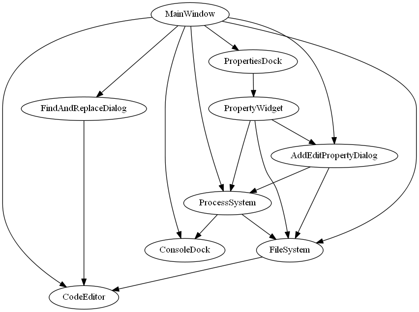
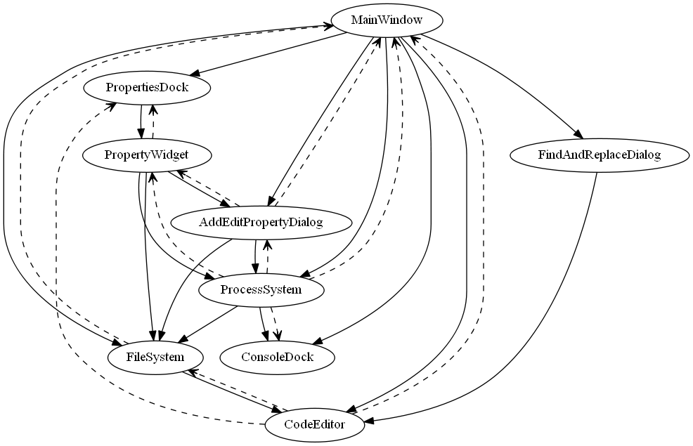

Architecture of mcrl2ide
========================

*Author: Olav Bunte*

Introduction
------------

The tool ``mcrl2ide`` is a graphical tool aimed at users unfamiliar with the mCRL2 toolset
to help them use the basic functionalities of the toolset. It is built using the Qt framework
and it consists of 11 header files, 12 source files, four ui files, one qrc file
(``mcrl2-ide.qrc``) and a folder of icons. There are 11 modules, each consisting of one header
and one source file. This leaves one source file, namely ``main.cpp``, which is the entry point
of the application. The four ui files, ``addeditpropertydialog.ui``,
``findandreplacedialog.ui``, ``rewriteexpressiondock.ui`` and ``tooloptionsdialog.ui``, are
created using Qt Creator and describe the widget layout of the respective dialogs and docks. The
qrc file describes what resources (icons) are used by the tool.

Modules
-------

There are 11 modules in ``mcrl2ide``: ``MainWindow``, ``ConsoleDock``, ``PropertiesDock``,
``PropertyWidget``, ``FindAndReplaceDialog``, ``AddEditPropertyDialog``,
``RewriteExpressionDock``, ``ToolOptionsDialog``, ``Utilities``, ``ProcessSystem`` and
``FileSystem``. Additionally, ``mcrl2ide`` uses the ``CodeEditor`` class from the GUI library
(``mcrl2::gui::qt::CodeEditor``). See :numref:`fig-classdepgraph` for the dependencies between
these modules.

.. _fig-classdepgraph:

   Dependency graph of the modules in ``mcrl2ide``. A full arrow from module A to module B
   means that A creates B or that A uses functions defined on B.

MainWindow
^^^^^^^^^^

``MainWindow`` is (after ``main.cpp``) the entry point of the application and it defines the
main window. As ``MainWindow`` is the entry point, it creates instances of almost all other
modules and passes them on when necessary.

It also creates the menu bar and the toolbar, including the actions that correspond to all
options on the menu bar and the toolbar. For every action a method is implemented that is called
when the action is triggered, which (often) then delegates handling this action to another module
(``FileSystem`` for file related actions, ``ProcessSystem`` for tool related actions).

Whenever the state changes, ``MainWindow`` takes care of the changes in the main window. For
instance, when a project has been opened the title changes and properties are added via
``PropertiesDock`` and when a process is running "start process" buttons change to "abort
buttons".

ConsoleDock
^^^^^^^^^^^

``ConsoleDock`` defines the ``QDockWidget`` that prints console output, by default located at
the bottom. It is mainly used by ``ProcessSystem`` to show progress of a running process and
output generated by the tools. It has one tab for each process type: parsing, simulation,
state space generation, verification and rewriting.

PropertiesDock
^^^^^^^^^^^^^^

``PropertiesDock`` defines the ``QDockWidget`` that holds defined properties, by default
located on the right. Whenever a new property is defined, the ``PropertiesDock`` creates the
corresponding ``PropertyWidget`` and lays it out in the dock.

PropertyWidget
^^^^^^^^^^^^^^

``PropertyWidget`` defines the widget that holds a property. It creates the buttons and
corresponding actions that appear on the ``PropertyWidget``. Similar to ``MainWindow``, it has
a method for each such action that is called when the action is triggered, which (often)
delegates handling this action to another module. It also creates an ``AddEditPropertyDialog``
that is used when editing a property.

FindAndReplaceDialog
^^^^^^^^^^^^^^^^^^^^

``FindAndReplaceDialog`` defines the dialog that is used to find and/or replace strings in the
specification editor. It also implements the functionality to do so. It uses ``ProcessSystem``
to parse the entered property and ``FileSystem`` to save the property.

AddEditPropertyDialog
^^^^^^^^^^^^^^^^^^^^^

``AddEditPropertyDialog`` defines the dialog that is used to add a property to the project
(add-variant) or to edit a previously defined property (edit-variant).

RewriteExpressionDock
^^^^^^^^^^^^^^^^^^^^^

``RewriteExpressionDock`` defines the ``QDockWidget`` that allows the user to rewrite a data
expression in the context of the current specification. It uses ``ProcessSystem`` to run the
rewriting subprocess and ``CodeEditor`` to obtain the current specification context.

ToolOptionsDialog
^^^^^^^^^^^^^^^^^

``ToolOptionsDialog`` defines the dialog that allows the user to configure per-project tool
options. It uses ``FileSystem`` to read and persist the tool configuration alongside the
project.

Utilities
^^^^^^^^^

``Utilities`` provides shared constants and helper widgets used across multiple modules. It
defines the ``EquivalenceComboBox`` widget and the sets of supported LTS equivalences
(``LTSEQUIVALENCENAMES``, ``LTSEQUIVALENCESWITHABSTRACTION``,
``LTSEQUIVALENCESWITHOUTABSTRACTION``) that are used by the LTS creation and reduction
workflows.

CodeEditor (GUI library)
^^^^^^^^^^^^^^^^^^^^^^^^

``CodeEditor`` (``mcrl2::gui::qt::CodeEditor``) is a shared text editor widget from the GUI
library; see :ref:`gui-codeeditor` for a full description. It lives outside ``mcrl2ide`` so
that other graphical tools in the toolset can reuse it.

ProcessSystem
^^^^^^^^^^^^^

``ProcessSystem`` handles all things related to tools. It creates and runs processes for any
tool action that can be required, such as parsing, creating a simulation, creating and
visualising a (reduced) state space and checking a property. It has one ``ProcessThread`` for
each process type, which uses queues to make sure that one process of that process type runs at
a time. How this works will be explained in more detail in :ref:`sec-processes`.

FileSystem
^^^^^^^^^^

``FileSystem`` handles all things related to files, such as creating, opening and saving files.
It also contains most of the application state such as project information.

Module lifetime
^^^^^^^^^^^^^^^

During the lifetime of the application, there is only one instance of the modules
``MainWindow``, ``ConsoleDock``, ``PropertiesDock``, ``FindAndReplaceDialog``,
``RewriteExpressionDock``, ``ToolOptionsDialog``, ``ProcessSystem`` and ``FileSystem``. The
number of instances of ``PropertyWidget`` can change, depending on how many properties are
defined in the current project. There is one instance of the add-variant of
``AddEditPropertyDialog`` (used by ``MainWindow``) and there is one instance of the edit-variant
of ``AddEditPropertyDialog`` for every ``PropertyWidget``. There is one instance of
``CodeEditor`` used by ``MainWindow`` and there is one instance of ``CodeEditor`` per
``AddEditPropertyDialog``.

The user can only directly change the number of instances of ``PropertyWidget``. All other
changes in the number of instances are caused (directly or indirectly) by a change in the
number of instances of ``PropertyWidget``.

Signals
^^^^^^^

Apart from invoking a method synchronously, in Qt it is also possible to invoke methods
asynchronously using signals. A signal can be connected to a method (slot) and when this signal
is emitted, a new thread will spawn for every slot it is connected to which then executes the
method. The main thread that emitted the signal simply continues right after emission. This is
especially useful for changing the UI when the state changes. In ``mcrl2ide`` this mechanism is
also used for handling processes. See :numref:`fig-classdepgraphwithsignals` for the dependency
diagram including signals between modules.

.. _fig-classdepgraphwithsignals:

   Dependency graph of the modules in ``mcrl2ide`` including signals. A full arrow from module
   A to module B means that A creates B or that A uses functions defined on B. A striped arrow
   from module A to B means that A can send signals to a slot on B.

Activity
--------

This section explains in more detail what activity happens in the background when the user
interacts with ``mcrl2ide``.

.. _sec-processes:

Processes
^^^^^^^^^

There are 5 process types (parsing, simulation, state space generation, verification and rewriting) and
each has its own ``ProcessThread``. Having a separate ``ProcessThread`` per process type allows
processes of different types to run in parallel.

Whenever the user invokes an action that needs tools to run, a process is created. A process
consists of subprocesses (``QProcess`` instances), each of which corresponds to a single run of
a single tool. The subprocess types are ``ParseMcrl2`` (which invokes ``mcrl22lps``),
``Mcrl22lps``, ``Lpsxsim``, ``Lps2lts``, ``Ltsconvert``, ``Ltscompare``, ``Ltsgraph``,
``ParseMcf`` (which invokes ``lps2pbes``), ``Lps2pbes``, ``Pbessolve`` and ``Mcrl2i``. When a
process is created, all corresponding subprocesses are created and all data needed by the
subprocesses (such as file paths) is fixed. After a process has been created, it is added to
the queue of the corresponding ``ProcessThread``.

A ``ProcessThread`` makes sure that queued processes are run in parallel with the main thread.
It can be in two states: *waiting* or *running*. If it is in state waiting, there is no process
running for this thread and there is no process in the queue. If it is in state running, there
is a process currently executing. While in a state it is blocked until it receives a signal
from outside. See :ref:`the ProcessThread state diagram <fig-procthread>` for the behaviour of a ``ProcessThread``. Note that
a ``ProcessThread`` only regulates the running of processes; it does not execute them itself.

.. _fig-procthread:

.. note::

   The ``ProcessThread`` state diagram was originally rendered as a TikZ figure in the LaTeX
   source. The states and transitions are described below.

**ProcessThread state transitions:**

- *Initial → Waiting*: the thread starts in the Waiting state.
- *Waiting → Running*: triggered when a process is added to the queue; the thread starts the
  next process.
- *Running → Waiting*: triggered when the current process finishes and the queue is empty.
- *Running → Running*: triggered when the current process finishes and the queue is not empty;
  the thread starts the next process.

After a subprocess has finished, a "finished" signal is sent that activates a slot that handles
starting the next subprocess. In case the next subprocess creates an output file, it is first
checked whether an up-to-date output file already exists. If so, the next subprocess does not
need to run and its "finished" signal is emitted directly. Otherwise, the next subprocess is
started.

When a process has finished, it emits its "finished" signal. Processes of type simulation or
state space generation end with a subprocess that runs a graphical tool (``lpsxsim``, ``ltsgraph``);
these emit their "finished" signal just before starting the last subprocess to allow viewing
multiple instances (for instance to see different reduced LTSs next to each other). Processes
of type parsing or verification emit their "finished" signal after the last subprocess has
finished. The result of these processes (valid/invalid or true/false) is stored in
``ProcessSystem`` and can be retrieved when necessary.

Processes may be aborted by the user. When this happens, it is first checked whether the
process is currently running. If so, the corresponding running subprocess is muffled (so that
it does not activate the next subprocess) and then killed. If the subprocess is not running but
in a queue, it is removed from the queue. In both cases the "finished" signal of the process is
emitted afterwards to let the corresponding ``ProcessThread`` continue with the next process and
to update the UI.
