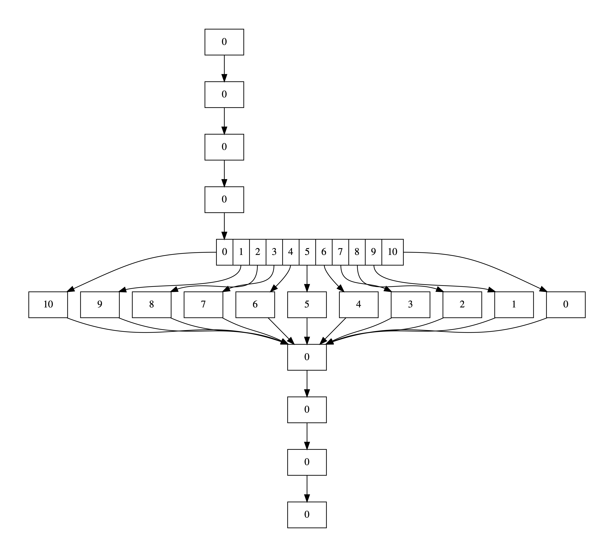

Symbolic Reachability
=====================

In this document we describe a symbolic reachability algorithm that uses list decision diagrams (LDDs) to store states and transitions.
It is based on the work in [MBvdP2008]_ and [Meijer2019]_.

Definitions
-----------

Let :math:`S` be a set of states, and :math:`R \subseteq S \times S` a transition relation. There is a transition from :math:`x` to :math:`y` if :math:`(x,y) \in R`.

We assume that the set of states :math:`S` is a Cartesian product

.. math::

   S = S_1 \times \ldots \times S_m

In other words, states are vectors of :math:`m` elements.

**Definition.**
The domain of a relation :math:`R` is defined as

.. math::

   \textsf{domain}(R) = \{ x \in S \mid \exists y \in S:  (x,y) \in R \}

**Definition.**
The function :math:`\textsf{next}` returns the successors of an element :math:`x \in S`:

.. math::

   \textsf{next}(R, x) = \{ y \in S \mid (x,y) \in R \}

It can be lifted to a subset :math:`X \subseteq S` using

.. math::

   \textsf{next}(R, X) = \cup \{ \textsf{next}(R, x) \mid x \in X \}

**Definition.**
The set of reachable states that can be reached from an initial state :math:`x \in S` is defined as

.. math::

       \textsf{reachable\_states}(R, x) = \{ y \in S \mid \exists n \geq 0: (x, y) \in R^n \}

Read, write and copy parameters
===============================

In [MKBvdP2014]_ three types of dependencies for the parameters of a relation are distinguished: *read dependence* (whether the value of a parameter influences transitions), *must-write dependence* (whether a parameter
is written to), and *may-write dependence* (whether a parameter may be written to, depending on the value of some other parameter). The may-write versus must-write distinction is introduced for arrays, that do not exist in mCRL2. So for our use
cases may- and must-write dependence coincide, and we will refer to it as
*write dependence* instead.

Before we formalize the notions *read independent* and *write independent*, it is important to understand the application that they are used for. We assume that we have a sparse relation :math:`R` that is defined as a set of pairs :math:`(x,y)` with :math:`x,y \in S`.
Our goal is to define the notions read and write independent such that the values of read and write independent parameters are not needed for the successor computation of :math:`R`. So for the values :math:`x_i,y_i` corresponding to a read independent parameter :math:`d_i` we do not need to store value :math:`x_i`, and for the values corresponding to a write independent parameter we do not need to store the value :math:`y_i`.

In order to satisfy these requirements we define a
read independent parameter as a parameter whose value is always copied (:math:`y_i = x_i`), or mapped to a constant value (:math:`y_i = c`). However, this is not enough for being able to discard the value of such a parameter. In addition, the corresponding transition has
to be enabled for any value in its domain. We define a write independent parameter as a parameter whose value is always copied  (:math:`y_i = x_i`).

**Definition.**
For a vector :math:`x = [x_1, \ldots, x_m] \in S` we define the following notation for updating the element at position :math:`i` with value :math:`y \in S_i`:

.. math::

   x[i=y] = [x_1, \ldots, x_{i-1}, y, x_{i+1}, \ldots, x_m]

We lift this definition to a set as follows.
Let :math:`I = \{ i_1, \ldots i_k \}` with :math:`1 \leq i_1 < \ldots < i_k \leq m` be a set of parameter indices, and
:math:`y \in S_{i_1} \times \ldots \times S_{i_k}`. Then

.. math::

   x[I = y] = z \text{ with } z_r =
     \left\{
       \begin{array}{ll}
            x_r & \text{if } r \notin I \\
            y_r & \text{otherwise}
       \end{array}
     \right.

**Definition.**

.. math::

   \textsf{always\_copy}(R, i) =
     (\forall (x, y) \in R: x_i = y_i) \land
     (\forall (x, y) \in R, d \in S_i: (x[i=d], y[i=d]) \in R)

**Definition.**

.. math::

   \textsf{always\_constant}(R, i) =
     (\exists d \in S_i: \forall (x, y) \in R: y_i = d) \land
     (\forall (x, y) \in R, d \in S_i: (x[i=d], y) \in R)

**Definition.**

.. math::

   \textsf{read\_independent}(R, i) =
   \textsf{always\_copy}(R, i) \lor \textsf{always\_constant}(R, i)

**Definition.**

.. math::

   \textsf{write\_independent}(R, i) =
     \forall (x, y) \in R: x_i = y_i

Note that our definitions differ slightly from the ones in [MKBvdP2014]_,
but they are equivalent. To illustrate these definitions, consider the
following example.

**Example.**
Let :math:`S = \mathbb{N} \times \mathbb{N} \times \mathbb{N}` and let :math:`R` be a relation on the variables :math:`x_1`, :math:`x_2` and
:math:`x_3` defined by the statement

.. math::

   \textsf{if } x_3 > 4 \textsf{ then begin } x_2 := 3 \textsf{ end}

In this case :math:`x_1` is both read and write independent, :math:`x_2` is
read independent, and :math:`x_3` is write independent. Even though the
value of :math:`x_3` is always copied, we do not consider it read independent. This is because for values :math:`x_3 \leq 4` the transition is not enabled,
and this information would be lost if we discard those values from
the transition relation. Now instead of storing the transition
:math:`((1,2,5), (1,3,5))`, we only need to store :math:`((5),(3))` to be able
to derive that a transition from :math:`(1,2,5)` to :math:`(1,3,5)` is possible.

Read and write parameters are defined using

**Definition.**

.. math::

   \textsf{read}(R, i) =
   \neg \textsf{read\_independent}(R, i)

**Definition.**

.. math::

   \textsf{write}(R, i) = \neg \textsf{write\_independent}(R, i)

**Definition.**

.. math::

   \textsf{read\_parameters}(R) = \{ i \mid \textsf{read}(R, i) \}

**Definition.**

.. math::

   \textsf{write\_parameters}(R) = \{ i \mid \textsf{write}(R, i) \}

Now let us consider an mCRL2 summand :math:`P` of the following shape:

.. math::

   P(d) = c(d) \rightarrow a(f(d)) . P(g(d))

For such a summand [MKBvdP2014]_ defines the following approximations of read and write parameters:

.. math::

   \textsf{read}_s(P, i) =
   \begin{array}{ll}
   d_i \in \textsf{freevars}(c(d)) & \lor \\
   (d_i \in \textsf{freevars}(g_i(d)) \land d_i \neq g_i(d)) & \lor \\
   \exists 1 \leq k \leq m: (d_i \in \textsf{freevars}(g_k(d)) \land i \neq k)
   \end{array}

.. math::

   \textsf{write}_s(P, i) = (d_i \neq g_i)

Indeed we have :math:`\textsf{read}_s(P, i) \Rightarrow \textsf{read}(P, i)` and
:math:`\textsf{write}_s(P, i) \Rightarrow \textsf{write}(P, i)`.

List Decision Diagrams
======================

A List Decision Diagram (LDD) is a DAG. It has two types of leaf nodes, :math:`\textsf{false}` and :math:`\textsf{true}`, or 0 and 1. The third type of node has a label :math:`a` and two successors \var{down} and \var{right}, or :math:`=` and :math:`>`.
An LDD represents a set of lists, as follows:

.. math::

   \begin{array}{lll}
       \sem{\textsf{false}} & = & \emptyset \\
       \sem{\textsf{true}} & = & \{ \emptylist \} \\
       \sem{\textsf{node}(v, \var{down}, \var{right})} & = &
          \{ vx \mid x \in \sem{\var{down}} \} \cup \sem{\var{right}}
   \end{array}

In [MBvdP2008]_ an LDD is defined as

**Definition.**
A List decision diagram (LDD) is a
directed acyclic graph with the following properties:

1. There is a single root node and two terminal nodes 0 and 1.
2. Each non-terminal node :math:`p` is labeled with a value :math:`v`, denoted by :math:`val(p) = v`,
   and has two outgoing edges labeled :math:`=` and :math:`>` that point to nodes denoted by
   :math:`p[x_i = v]` and :math:`p[x_i > v]`.
3. For all non-terminal nodes :math:`p`, :math:`p[x_i = v] \neq 0` and :math:`p[x_i > v] \neq 1`.
4. For all non-terminal nodes :math:`p`, :math:`val(p[x_i > v]) > v`.
5. There are no duplicate nodes.

LDDs are well suited to store lists that differ in only a few positions.
Consider the transition relation :math:`R` on :math:`S = \mathbb{N}^{10}` with initial state
:math:`x = [0, 0, 0, 0, 10, 0, 0, 0, 0, 0, 0]`, that is defined by

.. math::

   \textsf{if } x_5 > 0 \textsf{ then begin } x_5 := x_5 - 1; x_6 := x_6 + 1 \textsf{ end}

Clearly this is a sparse relation with :math:`\textsf{used}(R) = \{ 5, 6 \}`. The state space
consists of 11 states that differ only in the 5th and 6th parameter. It can be compactly
represented using an LDD, see the figure below. For our applications we use the LDD implementation that is part of the Sylvan multi-core framework for decision diagrams, see
[vDvdP2017]_.

Reachability
============

Computing the set of reachable states
-------------------------------------

A straightforward algorithm to compute the set of reachable states from an initial state
:math:`x \in S` is the following.

Reachability
~~~~~~~~~~~~

.. rst-class:: mcrl2_pseudocode

   .. math::
      :nowrap:
      :label: alg:reachability

            \begin{algorithmic}[1]
        \Function{ReachableStates}{$R, x$}
        \State {$\var{visited} := \{ x \}$}
        \State {$\var{todo} := \{ x \}$}
        \While {$\var{todo} \neq \emptyset$}
           \State {$\var{todo} := \textsf{next}(R, \var{todo}) \setminus \var{visited}$}
           \State {$\var{visited} := \var{visited} \cup \var{todo}$}
      \EndWhile
        \State \Return {$\var{visited}$}
      \EndFunction
            \end{algorithmic}

There are two bottlenecks in this algorithm. First of all the set :math:`\var{visited}` may be large and therefore consume a lot of memory. Second, the computation of :math:`\textsf{next}(R, \var{todo})` may become
expensive once :math:`\var{todo}` becomes large.

Reachability with learning
--------------------------

To reduce the memory usage, we store the sets :math:`visited` and :math:`todo` using LDDs. It is not always feasible to store the entire transition relation :math:`R` using LDDs, because it may be huge or even have infinite size. To deal with this, we only store the subset :math:`L` of :math:`R` that is necessary for the reachability computation in an LDD. The relation :math:`L` is computed (learned) on the fly.

Reachability with learning
~~~~~~~~~~~~~~~~~~~~~~~~~~

.. rst-class:: mcrl2_pseudocode

   .. math::
      :nowrap:
      :label: alg:reachability_with_learning

            \begin{algorithmic}[1]
        \Function{ReachableStates}{$R, x$}
        \State {$\var{visited} := \{ x \}$}
        \State {$\var{todo} := \{ x \}$}
        \State {$L := \emptyset$} \Comment{L is the learned relation}
        \While {$\var{todo} \neq \emptyset$}
           \State {$L := L \cup \{ (x,y) \in R \mid x \in \var{todo} \}$}  \Comment{This operation is expensive}
           \State {$\var{todo} := \textsf{next}(L, \var{todo}) \setminus \var{visited}$} \Comment{This operation is cheap}
           \State {$\var{visited} := \var{visited} \cup \var{todo}$}
      \EndWhile
        \State \Return {$\var{visited}$}
      \EndFunction
            \end{algorithmic}

Reachability of a sparse relation
---------------------------------

Suppose that we have a sparse relation :math:`R`, i.e. the number of read and write parameters is small. In that case we can use projections to increase the efficiency.

**Definition.**
The projection of a state :math:`x \in S` with respect to a set of parameter indices :math:`\{ i_1, \ldots i_k \}` with :math:`1 \leq i_1 < \ldots < i_k \leq m` is defined as

.. math::

   \textsf{project}(x, \{ i_1, \ldots, i_k \} ) = (x_{i_1}, \ldots, x_{i_k})

We lift this to a relation :math:`R` with read parameter indices :math:`I_r` and write parameter indices :math:`I_w` as follows:

.. math::

   \textsf{project}(R, I_r, I_w) = \{ (\textsf{project}(x,I_r), \textsf{project}(y,I_w)) \mid (x,y) \in R \}

The application of a projected relation to an unprojected state is defined using the function :math:`\textsf{relprod}`. The Sylvan function :math:`\textsf{relprod}` implements this, or something similar.

**Definition.**
Let :math:`R` be a relation with read parameter indices :math:`I_r` and write parameter indices :math:`I_w`, let :math:`x \in S` and let
:math:`\hat{R} = \textsf{project}(R, I_r, I_w)`. Then we define

.. math::

       \textsf{relprod}(\hat{R}, x, I_r, I_w) =
           \{
             x[I_w = \hat{y}] \mid \textsf{project}(x, I_r) = \hat{x} \land
             (\hat{x}, \hat{y}) \in \hat{R}
           \}

.. math::

       \textsf{relprev}(\hat{R}, y, I_r, I_w, X) =
           \{
              x \in X \mid y \in \textsf{relprod}(\hat{R}, x, I_r, I_w)
           %   y[I_r = \hat{x}] \mid \textsf{project}(y, I_w) = \hat{y} \land
           %   (\hat{x}, \hat{y}) \in \hat{R}
           \}

Reachability of a sparse relation using projections
~~~~~~~~~~~~~~~~~~~~~~~~~~~~~~~~~~~~~~~~~~~~~~~~~~~

.. rst-class:: mcrl2_pseudocode

   .. math::
      :nowrap:
      :label: line:r_successors

            \begin{algorithmic}[1]
        \Function{ReachableStates}{$R, x$}
        \State {$\var{visited} := \{ x \}$}
        \State {$\var{todo} := \{ x \}$}
        \State {$L := \emptyset$} \Comment{L is a projected relation}
        \State {$I_r, I_w := \textsf{read\_parameters}(R), \textsf{write\_parameters}(R)$}
        \While {$\var{todo} \neq \emptyset$}
		   \State {$L := L \cup \textsf{project}(\{ (x,y) \in R \mid x \in \var{todo} \}, I_r, I_w)$}
           \State {$\var{todo} := \textsf{relprod}(L, \var{todo}, I_r, I_w) \setminus \var{visited}$}
           \State {$\var{visited} := \var{visited} \cup \var{todo}$}
      \EndWhile
        \State \Return {$\var{visited}$}
      \EndFunction
            \end{algorithmic}

In this new version of the algorithm, the computation of the successors in line 7 is still the bottleneck:

.. math::

   L := L \cup \textsf{project}(\{ (x,y) \in R \mid x \in \var{todo} \}, I_r, I_w)

An important observation is that the same result can be obtained by applying the projected relation to the projected arguments:

.. math::

   L := L \cup \{ (x,y) \in \textsf{project}(R, I_r, I_w) \mid x \in \textsf{project}(\var{todo}, I_r) \}

For our applications, the set :math:`\textsf{project}(\var{todo}, I_r \cup I_w) \}` is typically much smaller than :math:`\var{todo}`, which means that a lot of duplicate successor computations in line 7 are avoided.

Reachability of a union of sparse relations
-------------------------------------------

We now consider a relation :math:`R` that is the union of a number of sparse relations. Examples of these sparse relations are the summands of an LPS or of a PBES in SRF format.

.. math::

   R = \bigcup_{i=1}^{n} R_i

Reachability of a union of sparse relations
~~~~~~~~~~~~~~~~~~~~~~~~~~~~~~~~~~~~~~~~~~~

.. rst-class:: mcrl2_pseudocode

   .. math::
      :nowrap:
      :label: alg:reachability4

        \begin{algorithmic}[1]
        \Function{ReachableStates}{$\{R_1, \ldots, R_n\}, x$}
        \State {$\var{visited} := \{ x \}$}
        \State {$\var{todo} := \{ x \}$}
        \For {$1 \leq i \leq n$}
           \State {$L_i := \emptyset$}
           \State {$I_{r,i}, I_{w,i} := \textsf{read\_parameters}(R_i), \textsf{write\_parameters}(R_i)$}
      \EndFor
        \While {$\var{todo} \neq \emptyset$}
           \For {$1 \leq i \leq n$}
              \State {$L_i := L_i \cup \{ (x,y) \in \textsf{project}(R_i, I_{r,i}, I_{w,i}) \mid x \in \textsf{project}(\var{todo}, I_{r,i})  \setminus \textsf{domain}(L_i) \}$}
          \EndFor
           \State {$\var{todo} := \left( \bigcup\limits_{i=1}^n \textsf{relprod}(L_i, \var{todo}, I_r, I_w) \right) \setminus \var{visited}$}
           \State {$\var{visited} := \var{visited} \cup \var{todo}$}
      \EndWhile
        \State \Return {$\var{visited}$}
      \EndFunction
            \end{algorithmic}

Note that in line 9 another optimization has been applied, by excluding elements in the projected todo list that are already in the domain of :math:`L_i`.
For all values in :math:`\textsf{domain}(L_i)` the outgoing transitions have already been determined.
We can also replace :math:`\textsf{domain}(L_i)` by a set :math:`X` that keeps track of all values of :math:`x` that have already been processed.
Let :math:`X` be initially the empty set and updated to :math:`X \gets X \cup \{x \in \textsf{project}(\var{todo}, I_{r,i})\}` at line 9.
The set :math:`X` contains all elements in :math:`\textsf{domain}(L_i)` but also all :math:`x` with no outgoing transitions.
In practice, the transitions of :math:`R_i` are computed on-the-fly and this additional caching can avoid these computations with the downside that it requires more memory.

Reachability with chaining
--------------------------

For symbolic reachability it can be useful to reduce the amount of breadth-first search iterations because this also reduces the amount of symbolic operations that have to be applied.
Updating the todo set after applying each sparse relation can potentially increase the amount of states that are visited and thus reduce the amount of breadth-first search iterations necessary.
Note that we only add the states for which all sparse relations have been applied to visited.

Reachability of a union of sparse relations
~~~~~~~~~~~~~~~~~~~~~~~~~~~~~~~~~~~~~~~~~~~

.. _reachability_with_chaining:

.. rst-class:: mcrl2_pseudocode

   .. math::
      :nowrap:

        \begin{algorithmic}[1]
        \Function{ReachableStates}{$\{R_1, \ldots, R_n\}, x$}
        \State {$\var{visited} := \{ x \}$}
        \State {$\var{todo} := \{ x \}$}
        \For {$1 \leq i \leq n$}
           \State {$L_i := \emptyset$}
           \State {$I_{r,i}, I_{w,i} := \textsf{read\_parameters}(R_i), \textsf{write\_parameters}(R_i)$}
      \EndFor
        \While {$\var{todo} \neq \emptyset$}
           \State {$\var{todo1} := \var{todo}$}
           \For {$1 \leq i \leq n$}
              \State {$L_i := L_i \cup \{ (x,y) \in \textsf{project}(R_i, I_{r,i}, I_{w,i}) \mid x \in \textsf{project}(\var{todo1}, I_{r,i})  \setminus \textsf{domain}(L_i) \}$}
              \State {$\var{todo1} := \var{todo1} \cup \textsf{relprod}(L_i, \var{todo1}, I_r, I_w)$}
          \EndFor
           \State {$\var{visited} := \var{visited} \cup \var{todo}$}
           \State {$\var{todo} := \var{todo1} \setminus \var{visited}$}
      \EndWhile
        \State \Return {$\var{visited}$}
      \EndFunction
            \end{algorithmic}

Reachability with deadlock detection
------------------------------------

To detect *deadlocks*, i.e., states with no outgoing transitions, during reachability we have to determine which states in the todo sets have no outgoing transitions after applying all the transitions groups.
This can be achieved as follows by considering the predecessors.

.. rst-class:: mcrl2_pseudocode

   .. math::
      :nowrap:

            \begin{algorithmic}[1]
        \Function{ReachableStates}{$\{R_1, \ldots, R_n\}, x$}
        \State {$\var{visited} := \{ x \}$}
        \State {$\var{todo} := \{ x \}$}
        \State {$\var{deadlocks} := \emptyset$}
        \For {$1 \leq i \leq n$}
           \State {$L_i := \emptyset$}
           \State {$I_{r,i}, I_{w,i} := \textsf{read\_parameters}(R_i), \textsf{write\_parameters}(R_i)$}
      \EndFor
        \While {$\var{todo} \neq \emptyset$}
           \State {$\var{potential\_deadlocks} := \var{todo}$}
           \For {$1 \leq i \leq n$}
              \State {$L_i := L_i \cup \{ (x,y) \in \textsf{project}(R_i, I_{r,i}, I_{w,i}) \mid x \in \textsf{project}(\var{todo}, I_{r,i})  \setminus \textsf{domain}(L_i) \}$}
          \EndFor
           \State {$\var{todo} := \left( \bigcup\limits_{i=1}^n \textsf{relprod}(L_i, \var{todo}, I_r, I_w) \right) \setminus \var{visited}$}
           \State {$\var{potential\_deadlocks} := \var{potential\_deadlocks} \setminus \left( \bigcup\limits_{i=1}^n \textsf{relprev}(L_i, \var{todo}, I_r, I_w, \var{potential\_deadlocks}) \right)$}
           \State {$\var{visited} := \var{visited} \cup \var{todo}$}
           \State {$\var{deadlocks} := \var{deadlocks} \cup \var{potential\_deadlocks}$}
      \EndWhile
        \State \Return {$\var{visited}$}
      \EndFunction
            \end{algorithmic}

For the chaining strategy we remove predecessors from the potential deadlocks at the end of every transition group iteration (on line 11 of :ref:`Reachability with chaining <reachability_with_chaining>` using :math:`\var{todo1}` instead of :math:`\var{todo}`.

Joining relations
-----------------

If two or more of the relations :math:`R_i` have approximately the same set of read and write parameters, it can be beneficial to join them into one relation. In [Meijer2019]_ this is called combining transition groups.
In order to
determine how well two relations match, we define a bit pattern for a relation that contains the read and write information of the parameters.

**Definition.**
The read write pattern of a relation :math:`R` is defined as

.. math::

   \textsf{read\_write\_pattern}(R) = [r_1, w_1, \ldots, r_m, w_m]

with

.. math::

     r_i = \textsf{read}(R, i) \text{ and } w_i = \textsf{write}(R, i) \hspace{1cm} (1 \leq i \leq m)

For two read write patterns :math:`p` and :math:`q`, we define :math:`p \lor q` as the bitwise or of both patterns. In other words, if :math:`r = p \lor q`, then :math:`r_i = p_i \lor q_i ~ (1 \leq i \leq 2m)`. Similarly we say that :math:`p \leq q` iff :math:`p_i \leq q_i` for :math:`1 \leq i \leq 2m`.

**Example.**
Let :math:`S = \mathbb{N} \times \mathbb{N}` and let :math:`T` and :math:`U` be relations on the variables :math:`x`, :math:`y`. Let :math:`T` be defined by
:math:`(x,y) \rightarrow (x + 1, x)`
and let :math:`U` be defined by
:math:`x, y := x + 2, y`.
In this case :math:`x` is a read independent parameter in both :math:`T` and :math:`U`, but according to the definition :math:`x` is not a read independent parameter of
:math:`T \cup U`.
Hence :math:`\textsf{read\_write\_pattern}(T) = 1101`,
:math:`\textsf{read\_write\_pattern}(U) = 1100`, and
:math:`\textsf{read\_write\_pattern}(T \cup U) = 1111`.

Row subsumption
~~~~~~~~~~~~~~~

In [Meijer2019]_ a notion called *row subsumption* is
introduced for joining relations. This notion is based on an extension to the theory, which ensures that the following property holds for two relations :math:`T` and :math:`U`:

.. _property_bitwise_or:

.. math::

   \textsf{read\_write\_pattern}(T \cup U) = \textsf{read\_write\_pattern}(T) \lor \textsf{read\_write\_pattern}(U)

It works as follows. Suppose we have a transition :math:`(x, y) \in T`, and let :math:`L` be the projected transition relation corresponding to :math:`T \cup U`. Then we insert the special value :math:`\blacktriangle` in :math:`L` for all entries of :math:`y` that correspond to a copy parameter of :math:`T` (i.e. with read write values 00). The meaning of this special value is that the corresponding parameter will not be overwritten by :math:`L`. The

This is achieved by using
:math:`\textsf{relprod}^\blacktriangle` instead of :math:`\textsf{relprod}`, which is
defined as follows:

.. math::

   x[I = y]^\blacktriangle = z \text{ with } z_r =
     \left\{
       \begin{array}{ll}
            x_r & \text{if } r \notin I \text{ or } y_r = \blacktriangle \\
            y_r & \text{otherwise}
       \end{array}
     \right.

.. math::

       \textsf{relprod}^\blacktriangle(\hat{R}, x, I_r, I_w, X) =
           \{
             x[I_w = \hat{y}]^\blacktriangle \mid \textsf{project}(x, I_r) = \hat{x} \land
             (\hat{x}, \hat{y}) \in \hat{R}
           \}

N.B. In the Sylvan :math:`\textsf{relprod}` function this functionality is implemented in a slightly different way, using a concept called 'copy nodes'. It requires that the matrix :math:`L` is assembled using the function :math:`\textsf{union\_cube\_copy}` instead of :math:`\textsf{union\_cube}`.

An algorithm for partitioning a union of relations
--------------------------------------------------

In this section we sketch an approach for making a partition of a union of relations :math:`R = \bigcup_{i=1}^n R_i` that is based on :ref:`the property in the previous section<property_bitwise_or>`. The goal is to create groups of relations :math:`R_i` that have approximately the same read write patterns. The main idea is that each group of the partition can be characterized by a read write pattern.

If we choose :math:`K` read write patterns :math:`p_1, \ldots, p_K` such that

.. math::

   \bigvee\limits_{k=1}^K p_k = \textsf{read\_write\_pattern}(R)

and

.. math::

   \forall 1 \leq i \leq n: \exists 1 \leq k \leq K: \textsf{read\_write\_pattern}(R_i) \leq p_k

then we can define :math:`K` groups by assigning relation :math:`R_i` to group :math:`k` if :math:`\textsf{read\_write\_pattern}(R_i) \leq p_k`. Note that a
relation :math:`R_i` can match multiple read write patterns :math:`p_k`, but in that case an arbitrary pattern may be chosen.

A heuristic for selecting suitable patterns :math:`p_k` is to choose them such that both

.. math::

   \sum\limits_{1 \leq k \leq K} \textsf{bitcount}(p_k)

and

.. math::

   \sum\limits_{1 \leq k < l \leq K} \textsf{bitcount}(p_k \land p_l)

are small. For example an SMT solver might be used to determine them.

Application: LPS Reachability
=============================

Consider the following untimed linear process specification :math:`P`, with initial state :math:`d_0`.

.. math::

   \begin{array}{l}
   P(d: D)=
   \sum\limits_{i\in I}\sum\limits_{e_i}c_i(d, e_i)\rightarrow a_i(f_i(d,e_i)) \cdot P(g_i(d,e_i))
   \end{array}

Each summand :math:`i \in I` defines a transition relation :math:`R_i` characterized by

.. math::

   \left\{
   \begin{array}{ll}
       e_i & \text{a sequence of summation variables} \\
       c_i(d, e_i) & \text{a condition} \\
       a_i(f_i(d,e_i)) & \text{a transition label} \\
       g_i(d,e_i) & \text{the successor states} \\
   \end{array}
   \right.

The set of states is :math:`D`, which is naturally defined as a
Cartesian product

.. math::

   D = D_1 \times \ldots \times D_m

In order to apply the reachability algorithm, we need the following ingredients:

.. _table_ingredients:

.. list-table::
   :header-rows: 0

   * - :math:`\{ (x,y) \in R_i \mid x \in todo \}`
     - enumerate solutions of condition
   * - conversion between states and LDDs
     - map values to integers
   * - :math:`\textsf{read\_parameters}(R_i)`
     - syntactic analysis
   * - :math:`\textsf{write\_parameters}(R_i)`
     - syntactic analysis
   * - :math:`\textsf{project}(R_i, I_{r,i}, I_{w,i})`
     - discard unused parameters
   * - :math:`\textsf{project}(\var{todo}, I_{r,i} \cup I_{w,i})`
     - :math:`\textsf{project}` (Sylvan function)
   * - :math:`\textsf{relprod}(L_i, \var{todo}, I_r, I_w)`
     - :math:`\textsf{relprod}` (Sylvan function)

For a summand of the shape :math:`R_i = c_i \rightarrow a_i(f_i) \cdot P(g_i)` we will now define the read and write dependencies.

.. math::

   \textsf{read}(R_i, j) =
   d_j \in \textsf{freevars}(c_i) \lor
   \exists 1 \leq k \leq m: (d_j \in \textsf{freevars}(g_{i,k}) \land (d_k \neq d_j \lor g_{i,j} \neq d_j))

.. math::

   \textsf{write}(R_i, j) = (d_j \neq g_{i,j})

Application: PBES Reachability
==============================

**Definition.**
A parameterised Boolean equation system (PBES) is a sequence of equations as defined by the following grammar:

.. math::

   \mathcal{E} ::= \emptyset \mid (\mu X(d:D) = \varphi) \mathcal{E} \mid (\mu X(d:D) = \varphi) \mathcal{E}

where :math:`\emptyset` is the empty PBES, :math:`\mu` and :math:`\nu` denote the least and greatest fixpoint operator, respectively, and :math:`X \in \chi` is a predicate
variable of sort :math:`D \rightarrow B`. The right-hand side :math:`\varphi` is a syntactically monotone predicate formula. Lastly, :math:`d \in V` is a parameter of
sort :math:`D`.

**Definition.**
Let :math:`\mathcal{E}` be a PBES. Then :math:`\mathcal{E}` is in standard recursive form (SRF) iff for all :math:`\sigma_i X_i(d:D) = \varphi) \in \mathcal{E}`, where
:math:`\varphi` is either disjunctive or conjunctive, i.e., the equation for :math:`X_i` has the shape

.. math::

     \sigma_i X_i(d:D) = \bigvee\limits_{j \in J_i} \exists e_j: E_j . f_{ij}(d,e_j) \land X_{g_{ij}}(h_{ij}(d, e_j))

or

.. math::

     \sigma_i X_i(d:D) = \bigwedge\limits_{j \in J_i} \forall e_j: E_j . f_{ij}(d,e_j) \implies X_{g_{ij}}(h_{ij}(d, e_j)),

where :math:`d = (d_1, \ldots, d_m)`.

PBES Reachability
-----------------

We will now define reachability for a PBES.
The set of states is :math:`S = \{ X_i(d) \mid 1 \leq i \leq n \land d \in D \}`.
Each summand :math:`(i,j)` with :math:`j \in J_i` defines a transition relation :math:`R_{ij}` that is characterized by the parameters

.. math::

   \left\{
   \begin{array}{ll}
       \sigma_i & \text{a fixpoint symbol} \\
       e_j & \text{a sequence of quantifier variables} \\
       (X = X_i) \land f_{ij}(d,e_j) & \text{a condition} \\
       X_{g_{ij}}(h_{ij}(d, e_j)) & \text{the successor states,} \\
   \end{array}
   \right.

where :math:`X(d)` is the current state.

In order to apply the reachability algorithm, we need the following ingredients (exactly the same as for LPSs):

.. _table_pbes_ingredients:

.. list-table::
   :header-rows: 0

   * - :math:`\{ (x,y) \in R_i \mid x \in todo \}`
     - enumerate solutions of condition
   * - conversion between states and LDDs
     - map values to integers
   * - :math:`\textsf{read\_parameters}(R_i)`
     - syntactic analysis
   * - :math:`\textsf{write\_parameters}(R_i)`
     - syntactic analysis
   * - :math:`\textsf{project}(R_i, I_{r,i}, I_{w,i})`
     - discard unused parameters
   * - :math:`\textsf{project}(\var{todo}, I_{r,i} \cup I_{w,i})`
     - :math:`\textsf{project}` (Sylvan function)
   * - :math:`\textsf{relprod}(L_i, \var{todo}, I_r, I_w)`
     - :math:`\textsf{relprod}` (Sylvan function)

Splitting Conditions
--------------------

Symbolic reachability is most effective when the number of read/write parameters and the number of transitions per transition group are small.
We can split the disjunctive conditions in a conjunctive equation as follows:
Consider a PBES :math:`\mathcal{E}` in SRF with an equation :math:`\sigma_i X_i(d:D) \in \mathcal{E}` of the shape:

.. math::

     \sigma_i X_i(d:D) &= \bigwedge\limits_{j \in J_i} \forall e_j : E_j . (\bigvee\limits_{k \in K_{ij}} f_{ijk}(d,e_j)) \implies X_{g_{ij}}(h_{ij}(d, e_j)) \\
     \sigma_i X_i(d:D) &= \bigwedge\limits_{j \in J_i} \forall e_j : E_j . \bigwedge\limits_{k \in K_{ij}} f_{ijk}(d,e_j) \implies X_{g_{ij}}(h_{ij}(d, e_j)) \\
     \sigma_i X_i(d:D) &= \bigwedge\limits_{j \in J_i}\bigwedge\limits_{k \in K_{ij}} \forall e_j : E_{ij} .  f_{ijk}(d,e_j) \implies X_{g_{ij}}(h_{ij}(d, e_j))

This transformation is safe and allows us to consider every :math:`f_{ijk}(d,e_j))` as its own transition group.
A similar transformation can be applied to conjunctions in a disjunctive equation.

We can apply another transformation to conjunctive conditions inside conjunctive equations.
By introducing a new equation for every conjunctive clause :math:`f_{ijk}(d,e_j))`, for :math:`k \in K_j`, we can remain in SRF by the following transformation:

.. math::

     \sigma_i X_i(d:D) &= \bigwedge\limits_{j \in J_i} \forall e_j : E_j . (\bigwedge\limits_{k \in K_{ij}} f_{ijk}(d,e_j)) \implies X_{g_{ij}}(h_{ij}(d, e_j)) \\
     \sigma_i X_i(d:D) &= \bigwedge\limits_{j \in J_i} \forall e_j : E_j . \bigvee\limits_{k \in K_{ij}} (\neg f_{ijk}(d,e_j) \lor X_{g_{ij}}(h_{ij}(d, e_j))) \\
     \sigma_i X_i(d:D) &= \bigwedge\limits_{j \in J_i} \forall e_j : E_j .  \textit{true} \implies Y_j(h_{ij}(d, e_j), e_j)

Where :math:`Y_j` is a fresh name and its equation defined as follows:

.. math::

   \nu Y_j(d : D, e_j : E_j) = (\bigvee\limits_{k \in K_{ij}} \neg f_{ijk}(d,e_j) \land Y_j(d, e_j)) \lor (\textit{true} \land X_{g_{ij}}(d, e_j))

Note that this transformation makes the variable :math:`e_j` visible in the state space.
Furthermore, this parameter is also quantified without a condition.
In practice, this means that the latter transformation is probably unwanted in the presence of quantifiers.
Note that every :math:`j \in J_i` can be transformed according to whether the condition is conjunctive or disjunctive respectively, or not transformed at all.
The cases for a disjunctive or conjunctive condition within a disjunctive equation are completely dual.

We can also observe that in the equation for :math:`Y_j` there is always a dependency on :math:`X_{g_{ij}}(h_{ij}(d, e_j))`, whereas, in the original equation this was guarded by :math:`(\bigwedge\limits_{k \in K_j} f_{ijk}(d,e_j))`.
Alternatively, we can also consider the following equation for :math:`Y_j` such that :math:`X_{g_{ij}}(h_{ij}(d, e_j))` still has (weaker) guards.

.. math::

   \nu Y_j(d : D, e_j : E_j) = \bigvee\limits_{k \in K_j} \textit{true} \land Y_{jk}(d, e_j) \\
   \nu Y_{jk}(d : D, e_j : E_j) = f_{ijk}(d,e_j) \implies X_{g_{ij}}(h_{ij}(d, e_j)), \text{for } k \in K_i

Parity Game Solving
===================

Let :math:`G = (V, E, r, (V_0, V_1))` be a parity game where :math:`V_0` and :math:`V_1` are disjoint sets of vertices in :math:`V` owned by :math:`0` (even) and :math:`1` (odd) respectively.
Furthermore, :math:`E \subseteq V \times V` is the edge relation, and we denote elements of it by :math:`v \rightarrow u` iff :math:`(v, u) \in E`.
Finally, :math:`r(v)` is the priority function assigning a priority to every vertex :math:`v \in V`.
For a non-empty set :math:`U \subseteq V` and a player :math:`\alpha`, the control predecessor of set :math:`U` contains the vertices for which player :math:`\alpha` can force entering :math:`U` in one step.
Let :math:`\pre{U}{V} = \{ u \in U \mid \exists v \in V: u \rightarrow v \}` then it is defined as follows:

.. math::

     \cpre{\alpha}{G}{U} = (V_{\alpha} \cap \pre{G}{U}) \cup (V_{1-\alpha} \setminus \pre{G}{V \setminus U})

The :math:`\alpha`-attractor into :math:`U`, denoted :math:`\attr{\alpha}{U,V}`, is the set of vertices for which player :math:`\alpha` can force any play into :math:`U`.
We define :math:`\attr{\alpha}{U,V}` as :math:`\bigcup\limits_{i \ge 0} \attr[i]{\alpha}{U,V}`, the limit of approximations\label{def:attractor} of the sets :math:`\attr[n]{\alpha}{U,V}`, which are inductively defined as follows:

.. math::

   \begin{array}{lcl}
   \attr[0]{\alpha}{G, U} & = & U \\
   \attr[n+1]{\alpha}{G, U} & = & \attr[n]{\alpha}{G, U} \\
         & \cup & \cpre{\alpha}{G}{\attr[n]{\alpha}{G, U}} \\
   \end{array}

We reformulate this into

.. math::

   \begin{array}{lcl}
   \attr[0]{\alpha}{G, U} & = & U \\
   \attr[n+1]{\alpha}{G, U} & = & \attr[n]{\alpha}{G, U} \\
         & \cup & (V_{\alpha} \cap \pre{V}{\attr[n]{\alpha}{G, U})} \\
         & \cup & (V_{1 - \alpha} \cap (V \setminus \pre{V}{V \setminus \attr[n]{\alpha}{G, U})} \\
   \end{array}

This can be further optimised by avoiding two intersections and only computing predecessors within :math:`V_{1 - \alpha}`.
Furthermore, for a union of sparse relations :math:`\rightarrow \,= \bigcup_{i=1}^{n} \rightarrow_i` we can also apply the transition relations :math:`\rightarrow_i` directly instead of determining :math:`\rightarrow` first.
For :math:`\pred_i(U, V) = \{ u \in U \mid \exists v \in V: u \rightarrow_i v \}` we define:

.. math::

   \begin{array}{lcl}
   \attr[0]{\alpha}{G, U} & = & U \\
   \attr[n+1]{\alpha}{G, U} & = & \attr[n]{\alpha}{G, U} \\
         & \cup & \bigcup_{i=1}^{n} \textsf{pre}_i(V_{\alpha}, \attr[n]{\alpha}{G, U}) \\
         & \cup & (V_{1 - \alpha} \setminus \bigcup_{i=1}^{n} \textsf{pre}_i(V_{1 - \alpha}, V \setminus \attr[n]{\alpha}{G, U}) \\
   \end{array}

First of all, we implement a variant of :math:`\cpre{\alpha}{G}{U}` that uses the union of sparse relations. The parameter :math:`Z_\var{outside}` can be used as an optimisation to reduce the amount of states considered, but can always be equal to :math:`V`. In the attractor set computation this will be equal to :math:`V \setminus \attr[n]{\alpha}{G, U})`.

Control predecessor set computation for a union of sparse relations
-------------------------------------------------------------------

.. rst-class:: mcrl2_pseudocode

   .. math::
      :nowrap:
      :label: alg:predecessor

         \begin{algorithmic}[1]
         \Function{CPre$_\alpha$}{$G = (V, E, r, (V_0, V_1)$, $\var{U}$, $\var{Z}_\var{outside}$}
            \State {$\var{P} := \pre{G}{U}$}
            \State {$\var{P}_\alpha := P \cap V_\alpha$}
            \State {$\var{P}_\var{forced} := P \cap V_{1 - \alpha}$}

            \For {$1 \leq i \leq n$}
               \State {$\var{P}_\var{forced} := \var{P}_\var{forced} \setminus \textsf{pre}_i(\var{P}_\textit{forced}, \var{Z}_\var{outside})$}
            \EndFor

            \State \Return {$\var{P}_\alpha \cup \var{P}_\var{forced}$}
         \EndFunction
         \end{algorithmic}

For the actual implementation of the attractor set scheme we make two additional observations.
Instead of determining all predecessors for states in :math:`V \setminus \attr[n]{\alpha}{U,V})` in the final step we only have to determine predecessors that can actually reach :math:`V \setminus \attr[n]{\alpha}{U,V})` in one step.
Furthermore, we can actually keep track of the states that have been added in the last iteration and were not yet part of the attractor set.
We then only have to compute predecessors with respect to this todo set.

Attractor set computation for a union of sparse relations
---------------------------------------------------------

.. rst-class:: mcrl2_pseudocode

   .. math::
      :nowrap:
      :label: alg:attractor_set

         \begin{algorithmic}[1]
         \Function{Attr$_\alpha$}{$G = (V, E, r, (V_0, V_1)$, $\var{U}$}
         \State {$\var{todo} := U$}
         \State {$\var{Z} := U$}
         \State {$\var{Z}_\var{outside} := V \setminus X$}

         \While {$\var{todo} \neq \emptyset$}
            \State {$\var{todo} := \textsf{CPre}_\alpha(G, \var{Z}, \var{Z}_\var{outside})$}
            \State {$\var{Z} := \var{Z} \cup \var{todo}$}
            \State {$\var{Z}_\var{outside} := \var{Z}_\var{outside} \setminus \var{todo}$}
         \EndWhile
         \State \Return {$\var{Z}$}
         \EndFunction
         \end{algorithmic}

Partial Solving and Safe (Chaining) Attractors
----------------------------------------------

We recall some of the definitions necessary for the purpose for partial solving (incomplete) parity games that is introduced in [LWW2022]_, and provide pseudocode for these algorithms as well.
First of all, we introduce the notion of an incomplete parity game :math:`\Game = (G, I)`, where :math:`I \subseteq V` is a set of incomplete vertices.

.. math::

     \spre{\alpha}{G}{U} = (V_{\alpha} \cap \pre{G}{U}) \cup (V_{1-\alpha} \setminus (\pre{G}{V \setminus U} \cup I))

Secondly, we extend our attractor set computation to allow chaining through the predecessors.
For this purpose we introduce a chaining predecessor function :math:`\textsf{chained\_pre}(G, U, W)` that has a parameter :math:`W` which defines the set of vertices where chaining is allowed.
A function is a chaining predecessor iff it returns a set :math:`P = \textsf{chained\_pre}(G, U, W)` such that :math:`\pre{G}{U} \subseteq P` and :math:`P \subseteq \{ u \in U \mid \exists v \in V: u \rightarrow_W^* v \}` such that :math:`u \rightarrow_W^* v` iff there is a sequence of vertices :math:`s \rightarrow u_0 \rightarrow u_1 \rightarrow \ldots \rightarrow _v ` for which :math:`u_0, u_1, \ldots \in W`.

Safe control predecessor set computation for a union of sparse relations
~~~~~~~~~~~~~~~~~~~~~~~~~~~~~~~~~~~~~~~~~~~~~~~~~~~~~~~~~~~~~~~~~~~~~~~~

.. rst-class:: mcrl2_pseudocode

   .. math::
      :nowrap:
      :label: alg:safe_control_predecessor

      \begin{algorithmic}[1]
      \Function{SPre$_\alpha$}{$\var{G} = (V, E, r, (V_0, V_1)$, $\var{U}$, $\var{Z}_\var{outside}, \var{I}, \var{W}$}
         \State {$\var{P} := \textsf{chained\_pre}(\var{G}, \var{U}, V_\alpha \cap \var{W})$}
         \State {$\var{P}_\alpha := P \cap V_\alpha$}
         \State {$\var{P}_\var{forced} := (P \cap V_{1 - \alpha}) \setminus I$}

         \For {$1 \leq i \leq n$}
            \State {$\var{P}_\var{forced} := \var{P}_\var{forced} \setminus \textsf{pre}_i(\var{P}_\textit{forced}, \var{Z}_\var{outside})$}
         \EndFor

         \State \Return {$\var{P}_\alpha \cup \var{P}_\var{forced}$}
      \EndFunction
      \end{algorithmic}

Winning Cycle Detection
~~~~~~~~~~~~~~~~~~~~~~~

First, we implement cycle detection for a set of vertices :math:`V` by determining the largest subset :math:`U` of :math:`V` such that every vertex in :math:`U` has a predecessor in :math:`U`, as presented in Algorithm~\ref{alg:cycles}.
If :math:`U` satisfies this condition then every vertex in :math:`U` is part of a cycle.

Cycle detection
~~~~~~~~~~~~~~~

.. rst-class:: mcrl2_pseudocode

   .. math::
      :nowrap:
      :label: alg:cycles

         \begin{algorithmic}[1]
         \Function{detect-cycles}{$V$}
         \State {$U := \emptyset$}
         \State {$U' := V$}
         \While {$U \neq U'$}
            \State {$U := U'$}
            \State {$U' := U \cap \textsf{pred}(U, U)$}
         \EndWhile
         \State \Return {$U$}
         \EndFunction
         \end{algorithmic}

If one of the players can force a play through a cycle of its own priority then these vertices (and all vertices in a attractor to that set) are won by that player.
Therefore, for every priority :math:`p` let :math:`\alpha = p \mod 2` be a player and let :math:`P = \{v \in V_\alpha \mid r(v) = p\}` be a subset of vertices owned by player of parity :math:`p`.
Then the set of vertices resulting from :math:`\attr{\alpha}{\textsf{detect-cycles}(V), V}` are won by player :math:`\alpha`.

References
----------

.. [MBvdP2008] Blom, S., van de Pol, J.: Symbolic Reachability for Process Algebras with Recursive Data Types. In: Fitzgerald, J.S., Haxthausen, A.E., and Yenigun, H. (eds.) Theoretical Aspects of Computing - ICTAC 2008. pp. 81-95. Springer, Berlin, Heidelberg (2008). https://doi.org/10.1007/978-3-540-85762-4_6.
.. [Meijer2019] Meijer, J.: Efficient learning and analysis of system behavior. (2019). https://doi.org/10.3990/1.9789036548441.
.. [MKBvdP2014] Meijer, J., Kant, G., Blom, S., van de Pol, J.: Read, write and copy dependencies for symbolic model checking. In: Yahav, E. (ed.) Hardware and Software: Verification and Testing. pp. 204-219. Springer International Publishing, Cham (2014). https://doi.org/10.1007/978-3-319-13338-6_16.
.. [vDvdP2017] van Dijk, T., van de Pol, J.: Sylvan: multi-core framework for decision diagrams. Int J Softw Tools Technol Transfer. 19, 675-696 (2017). https://doi.org/10.1007/s10009-016-0433-2.
.. [LWW2022] Laveaux, M., Wesselink, W., Willemse, T.A.C.: On-The-Fly Solving for Symbolic Parity Games. In: Fisman, D. and Rosu, G. (eds.) Tools and Algorithms for the Construction and Analysis of Systems. pp. 137-155. Springer International Publishing, Cham (2022). https://doi.org/10.1007/978-3-030-99527-0_8.
