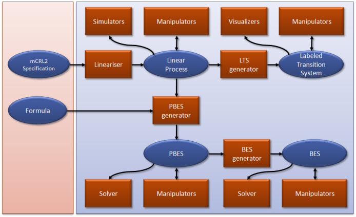

Introduction to mCRL2
=====================

mCRL2 stands for micro Common Representation Language 2. It is a specification
language that can be used to specify and analyse the behaviour of distributed
systems and protocols and is the successor to `µCRL <http://www.cwi.nl/~mcrl>`_.
Extensive theory is available for verifying processes manually. A major part of
this theory has been implemented in the accompanying toolset, allowing automatic
analysis and verification of systems.

Philosophy
----------

mCRL2 is based on the Algebra of Communicating Processes (ACP) which is
extended to include data and time. Like in every process algebra, a fundamental
concept in mCRL2 is the process. Processes can perform actions and can
be composed to form new processes using algebraic operators. A system usually
consists of several processes (or components) in parallel.

A process can carry data as its parameters. The state of a process is a
specific combination of parameter values. This state may influence the possible
actions that the process can perform. In turn, the execution of an action may
result in a state change. Every process has a corresponding state space or
Labelled Transition System (LTS) which contains all states that the process can
reach, along with the possible transitions between those states.

Using the algebraic operators, very complex processes can be constructed
containing, for example, lots of parallelism. A central notion in mCRL2 is the
linear process. This is a process from which all parallelism has been
removed to produce a series of condition - action - effect rules.
Complex systems, consisting of hundreds or even thousands of processes, can be
translated to a single linear process. Even for systems with an infinite state
space, the linear process (being an abstract representation of that state
space) is finite and can often be obtained very easily. Therefore, most tools
in the mCRL2 toolset operate on linear processes rather than on state spaces.

Model checking is provided using Parameterised Boolean Equation Systems (PBES).
Given a linear process and a formula that expresses some desired behaviour of
the process, a PBES can be generated. The solution to this PBES indicates
whether the formula holds on the process or not. An attempt can be made to
remove data from a PBES in order to obtain a BES, which is often easier to
solve.

History
-------

Around 1980 many process algebras were designed to model behaviour. Most notably
were CCS (Calculus of Communicating Processes, Milner), ACP (Algebra of
Communicating Processes, Bergstra and Klop) and CSP (Communicating Sequential
Processes, Hoare). These process algebras were mainly used as an object of
study, mainly due to their lack of proper data types.

In order to use these languages for actual modelling of behaviour a number of
process algebraic specifiation languages have been designed, which invariably
were extended with equational datatypes. The most well known is LOTOS (Language
of Temporal Ordering Specifications , Brinksma), but others are PSF (Process
Specification Formalism, Mauw and Veltink) and µCRL (micro Common Representation
Language, Groote and Ponse).

Unfortunately, the use of abstract data types made these languages unpleasant
when it came to the specification of complex behaviour. Therefore, we designed
the language mCRL2 (the successor of µCRL) to contain exactly those data types 
that one would expect when writing specifications, namely Bool, Pos, Nat, Int,
Real, lists, sets, bags, functions and functional data types. These data types
are machine independent. For instance there is no upperbound on natural numbers,
sets are not necessarily finite, quantification can be used within boolean terms
and lambda abstraction is part of the language. Furthermore, the language
features time and multi-actions, which were not present in most of the process
specification languages of the previous generation.

Note that mCRL2 is extremely rich and it is easy to express non-computable
behavioural specifications in it. Typically, for those specifications, tool
supported analysis will not be very fruitful. The advanced use of mCRL2 requires
a good understanding of the language, the underlying notions and even of the
implementation of the analysis tools. For more straightforward use this is not
needed. An effective rule of thumb is that everything that could be done using
languages such as LOTOS, PSF and µCRL, can be done without a problem using
mCRL2.

Toolset overview
----------------
An overview of the mCRL2 toolset is given in the picture below. It shows the
main concepts that play a role (in blue) and the operations that can be
performed on these concepts (in red). In the toolset, a file format is
associated with every concept and operations are implemented in tools. In order
to get a feeling for the relevant concepts and tools, we describe the workflow
of a typical analysis using mCRL2 below.

All tools can be accessed via a command-line interface. Another possibility is
to use the :ref:`tool-mcrl2-gui` tool which provides access to the tools via a GUI.

The rest of this section describes the different categories of tools that are
part of mCRL2.
  
mCRL2 specification and linearisation
^^^^^^^^^^^^^^^^^^^^^^^^^^^^^^^^^^^^^
Every analysis starts off by specifying the behaviour of the system being
studied. This can be any kind of system, though the main application of mCRL2 is
in distributed software systems. The specification can be seen as a model of the
real system: it is a simplified, or abstracted version of reality. Obtaining a
specification that is faithful to the real system is far from trivial and beyond
the scope of this overview.

An mCRL2 specification is a plain-text file containing a model in the mCRL2
language. It can be created using any text editor. For a description of the
mCRL2 language we refer to the Language reference.

Typically, the specification of a distributed system contains several processes
that run in parallel. The first step in the mCRL2 analysis process is to
linearise this specification to obtain a Linear Process Specification (LPS).
This is an mCRL2 specification from which all parallelism has been removed. All
that remains is a series of condition -- action -- effect rules that specify how
the system as a whole reacts to certain stimuli given its current state. Because
of its much simpler form, the LPS is much more suitable for automated analysis
than an mCRL2 specification. Therefore, most tools in the mCRL2 toolset operate
on LPSs.

The main tool for linearisation is :ref:`tool-mcrl22lps`. Given an mCRL2
specification, it produces an equivalent LPS on which other tools can be run. We
investigate these tools below.

LPS tools
^^^^^^^^^
An LPS is stored in a binary file format for efficiency. After having obtained
an LPS, a very useful analysis method is by simulating the model. Starting from
the initial state, sequences of actions can be performed which can quickly
reveal unexpected or erroneous behaviour. It is also a good way of getting
acquainted with the modelled behaviour.

The mCRL2 toolset contains two tools for simulation of an LPS: :ref:`tool-lpssim`
(command-line interface) and xsim (graphical user interface).

Some statistical information about an LPS can be collected using the
:ref:`tool-lpsinfo` tool. The LPS itself can also be printed in a pretty,
human-readable format. The tool for this task is :ref:`tool-lpspp`.

In essence, the LPS is a symbolic (or implicit) representation of the state
space or labelled transition system (LTS) that describes the behaviour of the
system explicitly. This LTS can be constructed from the LPS using a state space
generator. In mCRL2 the tool that performs this task is :ref:`tool-lps2lts`.

As state space generation can take a lot of time, it is often beneficial to
reduce the LPS or make it more suitable for state space generation. Several
tools are available for this, of which we mention a few here: :ref:`tool-lpssumelm`,
:ref:`tool-lpssuminst`, :ref:`tool-lpsparelm`, :ref:`tool-lpsconstelm` and :ref:`tool-lpsrewr`.

LTS tools
^^^^^^^^^
Once an LTS has been generated from an LPS, it can be visualised in several ways
using interactive GUI tools. The most straightforward way of visualising an LTS
is by showing it as a node-link diagram or graph. The :ref:`tool-ltsgraph` tool
performs this task. It can reorganise the produced image using a force-directed
algorithm.

The picture produced by ltsgraph can become very cluttered for larger LTSs.
Another LTS visualisation tool is :ref:`tool-ltsview` which employs a clustering
technique to reduce the complexity of the image. It produces a 3D visualisation
of the LTS and aims to show symmetry in the behaviour of the system.

The tool :ref:`tool-diagraphica` also clusters states to reduce complexity, producing
a 2D image. It clusters states based on state parameter values, instead of on
structural properties like :ref:`tool-ltsview`.

Apart from these visualisation tools, a powerful tool is :ref:`tool-ltsconvert` which
can reduce an LTS modulo various equivalences. This often produces an LTS that
is dramatically smaller than the original LTS, while important properties are
maintained. The tool can also convert between various LTS file formats, some of
which are textual, others binary.

An equally powerful tool is :ref:`tool-ltscompare` which can check whether two LTSs
are behaviourally equivalent or similar using various notions of
equivalence/similarity.

The tool :ref:`tool-lts2lps` can transform an LTS into an LPS, such that symbolic
computation can be continued, e.g. after minimisation.

Model checking using PBESs
^^^^^^^^^^^^^^^^^^^^^^^^^^
The aforementioned tools aid in getting more insight into the behaviour
specified by an mCRL2 specification. However, a system's analysis often involves
showing that the modelled system exhibits certain desired properties (or does
not exhibit undesired ones). This can be done using model-checking techniques,
which are very powerful verification methods.

In mCRL2, model checking is provided using parameterised boolean equation
systems (PBESs). As mentioned before, the central notion in mCRL2 is the LPS.
Not surprisingly, model checking also starts off with an LPS, which contains a
symbolic specification of the system's behaviour.

The other input needed for model checking, is a formula expressing a desired
property that the system should not violate (or satisfy). Such formulas are
expressed in the regular modal μ-calculus (extended with data) and can be
entered into a plain-text file using any text editor. The syntax of these
formulas is described in the Language reference.

Given an LPS and a formula, the tool lps2pbes produces a PBES in which the model
checking question of "does the formula hold for this LPS?" is encoded. The PBES
is stored in a binary file format. By solving the PBES, an answer to this
question can be found. The main tool for trying to solve a PBES is
:ref:`tool-pbes2bool`. It attempts to solve a given PBES and (if successful) returns
either true or false.

Note that solving PBESs is generally undecidable, so the attempt may fail. In
this case, more in-depth analysis of the PBES may be required. The tool
:ref:`tool-pbespp` is provided to pretty print a PBES in a human-readable format.
Statistical information can be obtained using :ref:`tool-pbesinfo` and the PBES can
be simplified using :ref:`tool-pbesrewr`. Furthermore some tools for simplifying the
PBES are available, such as :ref:`tool-pbesparelm` and :ref:`tool-pbesconstelm`.

Integration with other tools
^^^^^^^^^^^^^^^^^^^^^^^^^^^^
The mCRL2 toolset also integrates with other tool sets.
An interface with the TorX tool is provided by :ref:`tool-lps2torx`.
Furthermore, mCRL2 can be used as a language front-end for the
`LTSmin toolset <http://fmt.cs.utwente.nl/tools/ltsmin/>`_. It can
also be built against `CADP <http://cadp.inria.fr/>`_ to enable support
for the BCG file format for labelled transition systems. Furthermore,
a number of textual file formats are available, that facilitate easy
integration with other tools. Examples are the :ref:`language-aut-lts` for labelled
transition systems, that is, e.g., supported by `μCRL <http://homepages.cwi.nl/~mcrl/>`_
and `CADP <http://cadp.inria.fr/>`_. The CWI
format for Boolean equation systems, and finally, the GM file format,
which is supported by the `PGSolver <https://github.com/oliverfriedmann/pgsolver>`_
tools.

Finally, some tools may profit from the use of an external SMT solver.
For this purpose, mCRL2 can use the `CVC3 <http://www.cs.nyu.edu/acsys/cvc3/>`_
automatic theorem prover for SMT problems.
