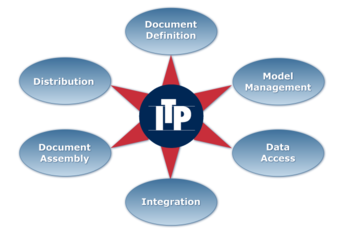

.. 

AIA ITP load-balancer
=====================

The AIA company is one of the world leading companies if it comes to
software for
print job distribution over document processors (high volume printers). 
The core of the software consists of 7.5 thousand lines of C code. 
In order to understand
this job distribution process better, a large part of this 
software system has been modeled and analyzed using
mCRL2. Six critical issues were discovered. 
Since the model was close to the code, all problems that
were found in the model, could be traced back to the actual code
resulting in concrete suggestions for improvement of the code.  All
in all, the analysis significantly improved the quality of this
system and led to its
`certification <http://www.laquso.com/certificates/AIA-ITP-Load-Balancer-2008>`_
by Laboratory for Quality Software (`LaQuSo <http://www.laquso.com>`_).

Technical details
-----------------
Session Layer of the load-balancer implementation was modeled in mCRL2 based on 
the C code. The underlying network socket administration layer and the upper application 
layers were modeled in an abstract way. 
 
Type of verification
^^^^^^^^^^^^^^^^^^^^
Deadlock and safety properties violations detection by explicit state-space generation
(breadth-first search).

Data size
^^^^^^^^^
For the case of 3 clients and 1 server configuration 1.9 billion states was generated.

Equipment (computers, CPU, RAM)
^^^^^^^^^^^^^^^^^^^^^^^^^^^^^^^
Large experiments were performed on an 8-way AMD 64 bit machine with 128Gb RAM. 

Models
^^^^^^
The model is available as an appendix of [EHSU07a]_

Organizational context
----------------------

.. list-table::
  :stub-columns: 1
  :widths: 1,3 

  * - Contact person
    - Yaroslav S. Usenko (LaQuSo Eindhoven)
  * - Other people involved
    -   * Marko van Eekelen (LaQuSo Nijmegen)
        * Stefan ten Hoedt (AIA)
        * René Schreurs (AIA)
  * - Institution
    - The project was a cooperation between two branches of `LaQuSo <http://www.laquso.com>`_:
      LaQuSo Nijmegen, a part of Radboud Universiteit Nijmegen, and
      LaQuSo Eindhoven, a part of Technische Universiteit Eindhoven
  * - Industrial partner
    - `Aia Software B.V. <http://www.aia-itp.com>`_, a mid-size software development
      company with headquaters in Nijmegen, The Netherlands.
  * - Project
    - The work was supported by `SenterNovem <http://www.senternovem.nl>`_ Innovation Voucher Inv053967.
  * - Time period
    - Main project including the modeling and verification was the first half of 2006.
      Later on verification of  bigger instances were performed.

Publications
------------
.. [EHSU07a] M. van Eekelen, S. ten Hoedt, R. Schreurs, and Y.S. Usenko.
   "Modeling and verifying a Real-Life Industrial Session-Layer Protocol in mCRL2."
   Technical report: +ICIS-R07014, June, Radboud University Nijmegen, 2007.
   `(PDF) <http://repository.ubn.ru.nl/bitstream/2066/34449/1/34449.pdf>`_
   
.. [EHSU07b] M. van Eekelen, S. ten Hoedt, R. Schreurs, Y.S. Usenko,
   "Analysis of a Session-Layer Protocol in mCRL2. Verification of a Real-Life Industrial Implementation."
   Proc. 12th FMICS 2007. 1-2 July. Berlin. LNCS 4916.
   `(DOI) <http://dx.doi.org/10.1007/978-3-540-79707-4_15>`_
   Also appeared as a Radboud University Nijmegen Technical Report [EHSU07a]_.

