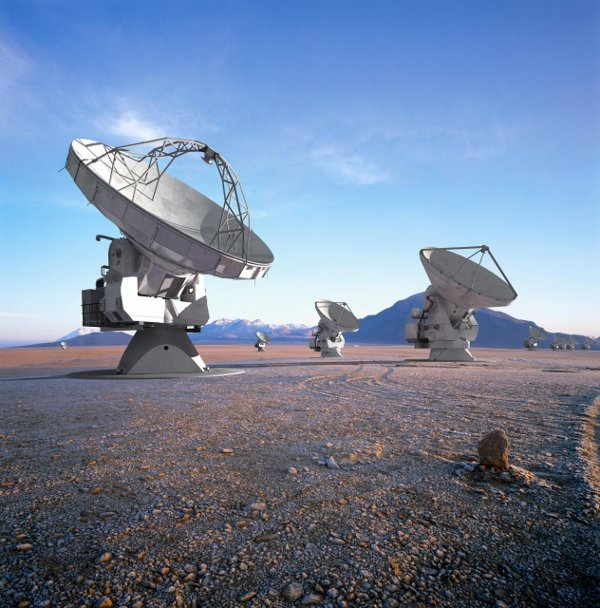

.. _showcase-alma:

Atacama Large Millimeter Array
==============================

The `Atacama Large Millimeter Array (ALMA) <http://almaobservatory.org>`_
is the largest ground observatory
system developed by astronomical organizations in Europe, North-America and
Japan. Currently (2009), it is still under construction. When fully operational,
it will consist of at least 50 antennas that operate in the millimeter and
submillimeter wavelength range. The ALMA site is in the Chilean Atacama desert
at an altitude of approximately 5000 meters.

The ALMA Common Software (ACS) is a software infrastructure for ALMA that is
based on CORBA. It is an essential framework within the ALMA software system,
providing a collection of common software components and services that other
parts of the system rely upon. Therefore, it is important for the ACS platform
to be stable and reliable.

We have analysed a part of the ACS framework using mCRL2. We focused on the ACS
Manager and the startup of components, along with their associated containers.
The model was constructed based on discussions with engineers, the documentation
and source code, and subsequently analysed for deadlocks. No deadlocks were
found. We found timeouts to be essential for deadlock-freedom of the system and
have reflected on this issue together with the engineers.

Technical details
-----------------

*Type of verification*
   Construct model out of existing source code and discussions with engineers.
   Check for deadlocks and validation by simulation.

*Data size*
   The state space was rather small and consisted of 3.484 states and 9.832
   transitions.

*Equipment (computers, CPU, RAM)*
   Acer Aspire Timeline 3810T notebook with an Intel 1.4GHz Core 2 Duo SU9400
   processor and 4 GB of RAM.

*Models*
   The model is available as an appendix to [Ploeger09]_. It is also distributed
   with the mCRL2 toolset.

*Organizational context*
   :Contact person: Bas Ploeger, Technische Universiteit Eindhoven, The  
                    Netherlands.
   :Other people involved: - Jan Friso Groote, Technische Universiteit Eindhoven, The Netherlands.
                           - Heiko Sommer, European Southern Observatory, Garching, Germany.
                           - Gianni Raffi, European Southern Observatory, Garching, Germany.
                           - Joseph Schwarz, European Southern Observatory, Garching, Germany.
   :Institution: Technische Universiteit Eindhoven, The Netherlands.
   :Industrial partner: European Southern Observatory, Garching, Germany.
   :Time period: March 2009 -- August 2009

Publications
------------

[Plo09]_

