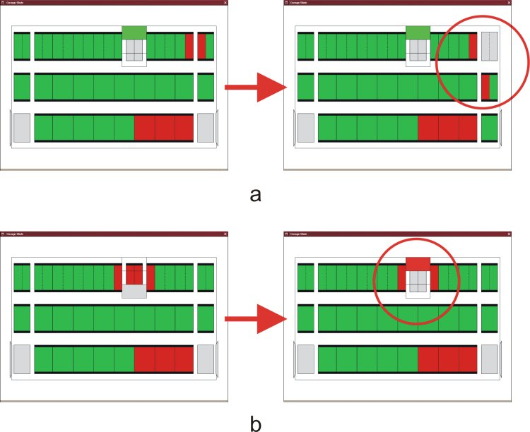

.. _showcase-garage:

Automated parking garage
========================

.. image:: img/ParkingGarageEnter.png
   :align: right
   :width: 250px

Parking garages that stow and retrieve cars automatically are becoming
viable solutions for parking shortages. However, these are complex
systems and a number of severe incidents involving such garages have
been reported. Many of these are related to safety issues in software.
We applied verification techniques to develop a software design for an
automated parking garage. This design meets a number of safety
requirements. To do so we developed a software architecture that allows
one to split implementation, safety and algorithmic aspects of the
software. We also developed a custom visualization tool to assist us
with our analysis. This enabled us to find a number of serious errors.

The visualization plug-in for the parking garage visualizes the garage as
seen from the top. Using this tool we were able to identify a number of
mistakes.

a) It was possible to tear a car in half with the shuttles toward the left
   and right of the parking garage.
b) It was possible to damage two cars using the lift.
   

Technical details
-----------------

*Type of verification*
   A number of safety requirements were verified. Using a custom visualization
   tool, a number of errors that had not been specified as safety requirements
   were found.

*Data size*
   The original specification would have resulted in an estimated 640 billion
   states, making it prohibitively large. After a number of simplifications 3.3
   million states were generated and verified.

*Equipment (computers, CPU, RAM)*
   Verification took 35 hours and 16 minutes on a single PC (3 GHz CPU, 4 GB
   RAM), and 5 hours and 38 minutes on a cluster of 34 CPUs (3 GHz CPU, 2 GB
   RAM).

*Models*
   The model is available as an appendix to [MP05]_. It is also distributed with
   the mCRL2 toolset.

*Organizational context*
   :Contact person: Aad Mathijssen, Technische Universiteit Eindhoven, The 
                    Netherlands.
   :Other people involved: Hannes Pretorius, Technische Universiteit Eindhoven, 
                           The Netherlands.
   :Institution: Technische Universiteit Eindhoven, The Netherlands.
   :Industrial partner: CVSS Parking Systems, Eindhoven, The Netherlands
   :Time period: June 2005 -- December 2005

Publications
------------

[MP07]_

