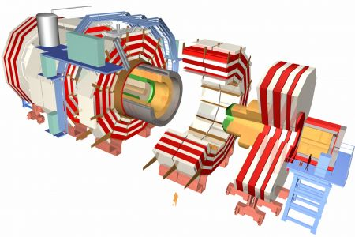

Control Software of the CMS Experiment at CERN's Large Hadron Collider
======================================================================

The Large Hadron Collider (LHC) experiment at the `European Organization for
Nuclear Research (CERN) <http://www.cern.ch>`_ has been built in a tunnel 27 kilometres in
circumference and is designed to yield head-on collisions of two proton (or ion)
beams of 7 TeV each. The Compact Muon Solenoid (CMS) experiment is one of the
four big experiments of the LHC. It is a general purpose detector to study the
wide range of particles and phenomena produced in the high-energy collisions in
the LHC.

The architecture of the control software for all four big LHC experiments is
based on the SMI++ framework. Under the SMI++ framework, the real world is
viewed as a collection of objects behaving as finite state machines (FSMs).
These FSMs are described using the State Manager Language (SML). A
characteristic of the used architecture is the regularity and relatively low
complexity of the individual FSMs and device drivers that together constitute
the control software; the main source of complexity is in the cooperation of
these FSMs. Cooperation is strictly hierarchical, consisting of several layers;
commands are refined and propagated down the hierarchy and status updates are
sent upwards. Hardware devices are typically found only at the bottom-most
layer. The FSM system in the CMS experiment contains well over 25,000 nodes. The
exact number fluctuates as a result of continuous development of the control
system; a recent count revealed over 27,500 nodes.  

Techniques
----------

Formalisation
^^^^^^^^^^^^^
We have developed a prototype translation of SML to mCRL2. The transformation is
coded using the `ASF+SDF meta-environment <http://www.meta-environment.org/Meta-Environment/ASF%2BSDF>`_.
As a result, any finite state machine
in production at CERN can be transformed to an mCRL2 process and analysed. The
correctness of the translation was, on the one hand, assessed using simulation
and visualisation of finite state machines in isolation, and on the other hand,
using formal verification (model checking using the mu calculus) of an mCRL2
model of an entire subsystem, viz., the Wheel subsystem. The latter is a
component of the Resistive Plate Chamber (RPC) subdetector of the CMS
experiment. The feedback obtained by the verification and simulation enabled us
to further improve the transformation. 

Bugs Detected
^^^^^^^^^^^^^
Drawing inspiration from our formal verification of the Wheel subsystem of the
RPC subdetector using model checking, we have developed dedicated tooling for
checking properties that can be verified on finite state machines in isolation. 

Verifications with these dedicated tools revealed that up-to 20% of the non-leaf
finite state machines suffers from livelocks that can cause parts of the system
to be temporarily or permanently non-responsive. That amounts to over 5% of all
finite state machines in the control software. Moreover, outages of the control
system have been traced back to livelocks that we detected using our dedicated
verification tooling. In addition, nearly 11% of the finite state machines in
the control software was found to suffer from reachability issues. 

Future
^^^^^^
As of December 2011, we also have access to the control software for the
remaining 3 large experiments (ATLAS, LHC beauty and ALICE). Our efforts for
further analysing the system continue. On the one hand, we plan to scale our
model checking techniques and verify larger subsystems; for this recently
developed abstraction techniques will be employed and improved. On the other
hand, we will continue our efforts to develop dedicated verification tooling
that can be integrated in CERN's development environment.

Technical details
-----------------
 
Type of verification
^^^^^^^^^^^^^^^^^^^^
Simulation/Validation/Model Checking/Satisfiability Solving
 
Equipment (computers, CPU, RAM)
^^^^^^^^^^^^^^^^^^^^^^^^^^^^^^^
28 Intel Xeon E5520 Processors running at 2.27GHz with 1TB of shared main memory
running a 64-bit Linux distribution using kernel version 2.6.27. 

mCRL2 toolset rev: 9500-9800.

Models
^^^^^^
The models that were used for verification were generated directly from a
database of Finite State Machines. The mCRL2 model of the Wheel subsystem is
included in the appendix of the arXiv report. Other mCRL2 models can be obtained
upon request.

Organisational context
----------------------

.. list-table:: 

  * - **Contact person**
    - `Tim A.C. Willemse <http://www.win.tue.nl/~timw>`_, Technische Universiteit Eindhoven, The Netherlands.
  * - **Other people involved**
    -   * CERN: Robert Gomeiz-Reino Garrido, Frank Glege, Yi Ling Hwong, Sander Leemans, Lorenzo Masetti
        * TU/e: Jan Friso Groote, Jeroen Keiren
        * ETH Zurich: Vincent Kusters
  * - **Institution**
    - Technische Universiteit Eindhoven, The Netherlands.
  * - **Industrial partner**
    - The project is carried out in cooperation with CERN, Geneva, Switzerland.

Publications
------------
.. [HKW11] Y.L. Hwong, V.J.J. Kusters and T.A.C. Willemse,
   ''Analysing the Control Software of the Compact Muon Solenoid Experiment at the Large Hadron Collider.''
   In ''Proc. of FSEN 2011'', Lecture Notes in Computer Science, Springer, vol. 7141, pp 174-190, 2011.
   An extended version is available as [HKW11a]_
   
.. [HKW11a] Y.L. Hwong, V.J.J. Kusters and T.A.C. Willemse,
   ''Analysing the Control Software of the Compact Muon Solenoid Experiment at the Large Hadron Collider.''
   CoRR abs/1101.5324.
   `(DOI) <http://arxiv.org/abs/1101.5324>`_.

