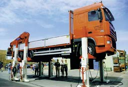

Distributed system for lifting trucks
=====================================

µCRL was used in the analysis of a real-life system for lifting trucks (lorries, 
railway carriages, buses and other vehicles). The system consists of a number of
lifts; each lift supports one wheel of the truck that is being lifted and has
its own microcontroller. The controls of the different lifts are connected by
means of a cyclical network. A special purpose protocol has been developed to
let the lifts operate synchronously. Four errors were found in the original
design. A solution to these problems was proposed and it was shown by means of
model checking that the modified system meets the requirements.

Technical details
-----------------

Two safety, two liveness properties and deadlock freedom were checked.

*Type of verification*
  Deadlock and safety properties violations detection by explicit state-space
  generation (breadth-first search). CADP toolset was used to model-check the
  properties formulated in regular alternation-free modal µ-calculus.
 
*Equipment (computers, CPU, RAM)*

*Models*
  The model is available as a part of the µCRL Toolset. A translation of this
  model to mCRL2, performed by Bas Ploeger, is distributed with the mCRL2
  Toolset.

*Organizational context*
  :Contact person: Jun Pang
  :Other people involved: - Bert Lisser (CWI)
                          - Jan Friso Groote (TU/e)
                          - Arno Wouters
  :Institution: `CWI <http://www.cwi.nl>`_, Amsterdam, The Netherlands
  :Industrial partner: `Add-Controls <http://www.add-controls.nl>`_, Amersfoort, 
                       The Netherlands
  :Time period: Around 2000

Publications
------------
.. [GPW03] Analysis of a distributed system for lifting trucks.
   Jan Friso Groote, Jun Pang, and Arno Wouters.
   Journal of Logic and Algebraic Programming, 55(1-2): 21-56, 2003.
   `(DOI) <http://dx.doi.org/10.1016/S1567-8326(02)00038-3>`_

Links
-----
Another description of this showcase is available on the
`CADP homepage <http://www.inrialpes.fr/vasy/cadp/case-studies/01-b-lift.html>`_.
