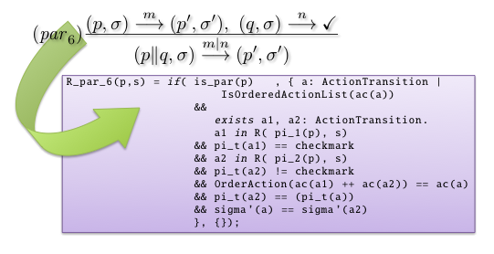

Dogfooding the structural operational semantics of mCRL2
========================================================

The mCRL2 language is a formal specification language that is used to specify
and model the behavior of distributed systems and protocols. With the
accompanying toolset, it is possible to simulate, visualize, analyze and verify
behavioral properties of mCRL2 models automatically. The semantics of the mCRL2
language is defined formally using Structural Operational Semantics (SOS) but
implemented manually in the underlying toolset using C++.

Like with most formal languages, the underlying toolset was created with the
formal semantics in mind but there is no way to actually guarantee that the
implementation matches the intended semantics.

To validate that the implemented behavior for the mCRL2 language corresponds to
its formal semantics, we describe the SOS deduction rules of the mCRL2 language,
and perform the transformation from the mCRL2's SOS deduction rules to a Linear
Process Specification. As our transformation directly takes the SOS deduction
rules and transforms them into mCRL2 data equations, we are basically feeding
the mCRL2 toolset its own formal language definition.

This report describes (i) the semantics for the untimed fragment of the mCRL2
language, (ii) the transformation of the deduction rules into data equations
including the underlying design decisions and (iii) the experiments that have
been conducted with our semantic transformation.

Despite its formal characterization, thorough study and broad use in many areas,
our semantic dogfooding approach revealed a number of (subtle) differences
between the mCRL2's intended semantics, the defined semantics and its actual
implementation.

Technical details
-----------------
With our approach we capture the untimed semantics of mCRL2 in (roughly) 1000
lines of mCRL2 code. 
 
Type of verification
^^^^^^^^^^^^^^^^^^^^
Simulation/Validation
 
Equipment (computers, CPU, RAM)
^^^^^^^^^^^^^^^^^^^^^^^^^^^^^^^
2.8 GHz Intel Core Duo, Mac OS-X 10.6.8, 4GB 800 MHz

mCRL2 toolset rev: 9500-9800.

Models
^^^^^^
The model is available as an appendix of [SRGW11]_.

Organizational context
----------------------

.. list-table:: 

  * - **Contact person**
    - Frank Stappers, Technische Universiteit Eindhoven, The Netherlands.
  * - **Other people involved**
    -   * Michel Reniers (TU/e Eindhoven)
        * Jan Friso Groote (Technische Universiteit)
        * Sven Weber (ASML)
  * - **Institution**
    - Technische Universiteit Eindhoven, The Netherlands.
  * - **Industrial partner**
    - The project was a cooperation with `ASML <http://www.asml.com/>`_ in Veldhoven, The Netherlands.

Publications
------------
.. [SRGW11] Stappers, F.P.M., Reniers, M.A., Groote, J.F., Weber, S.,
   "Dogfooding the structural operational semantics of mCRL2",
   Computer Science Report, No. 11-18, Eindhoven: Technische Universiteit Eindhoven, 87 pp, 2011
   `(PDF) <http://alexandria.tue.nl/repository/books/724474.pdf>`_

