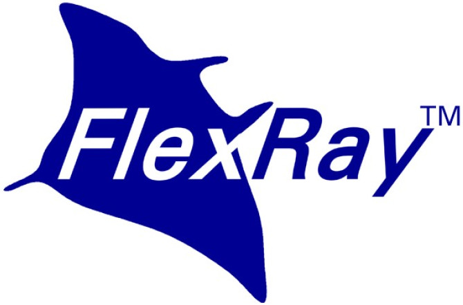
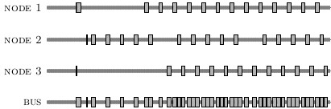

.. _showcase-flexray:

FlexRay communication protocol
==============================

The FlexRay protocol is an automotive communication standard, which was designed
to be reliable and time-triggered to support safety-critical applications in a
car. A part of the controller was modelled using mCRL2 (adapted slightly to 
incorporate a notion of inheritance), and it was checked whether the start-up 
sequence always leads to a successfully communicating network, even if one node
misbehaves. This is not the case. Resulting error traces were visualised as shown
below.

Technical details
-----------------
The parts of the Protocol Operation Control (POC) process of the FlexRay controller
that are involved in the start-up protocol were modelled in full detail. For
components other than the POC, more abstract models were introduced. Verification
was then carried out for a 3-node network. The largest state space that was 
considered had around 26 million states and 76 million transitions.

 
*Type of verification*
  Deadlock, safety and liveness properties checking.

*Organizational context*
  :Contact person: Sjoerd Cranen, Technische Universiteit Eindhoven, The Netherlands.
  :Institution: Technische Universiteit Eindhoven, The Netherlands
  :Time period: 2012

Publications
------------

[Cra12]_

