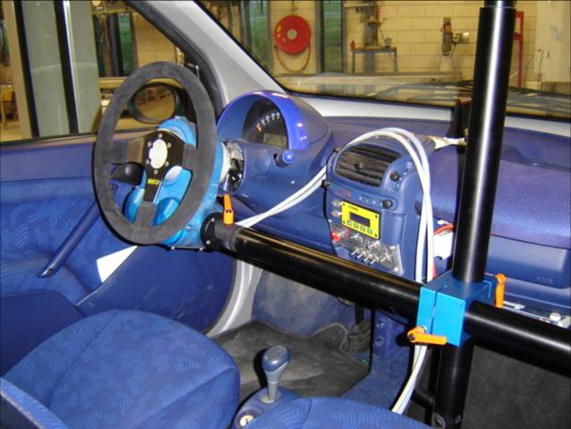

Generic Driving Actuator
========================

A Generic Driving Actuator is a device capable of driving a vehicle fully
automatically using the same interface as a human driver does, e.g. using
steering wheels and the throttle and brake pedals. It is used for driving tests
that are hazardous, or require very precise steering capability. In this project
the safety-critical software for such a Generic Driving Actuator was designed.
First a model was made using process algebra with data, and subsequently
properties that were formulated as modal formulas were verified. During the
process a few design with possibly fatal consequences were noted and could be
repaired. The final model for the software satisfies all requirements.

Technical details
-----------------
The requirements on the software of the Generic Driving Actuator were checked.

*Type of verification*
  Deadlock and safety properties violations detection by explicit state-space
  generation (breadth-first search). The CADP toolset was used to model-check the
  properties formulated in regular alternation-free modal µ-calculus. Some problems
  were found in the original specification and two contradictory requirements were
  found during the verification.

*Data size*
  The original specification was not possible to generate. By using CADP toolset
  it was possible to generate one transition system from several communicating
  transition systems. With this tool it was possible to first reduce parts of the
  transition system, before combining these parts. The resulting transition system
  only had 1.5 million states.

*Equipment (computers, CPU, RAM)*
  Verification took 8 hours on a 32bits linux machine with 4GByte of memory.

*Models*
  The model is available as an appendix to [MDC07a]_.

*Organizational context*
  :Contact person: Leon Merkx
  :Other people involved: - Hans-Martin Duringhof (TNO)
                          - Jan Friso Groote (TU/e)
                          - Pieter Cuijpers (TU/e)
  :Institution: Technische Universiteit Eindhoven, The Netherlands
  :Industrial partner: TNO Automotive, Helmond, The Netherlands
  :Time period: 2005 -- 2006

Publications
------------

.. [MDC07a] Safety-critical design of the generic driving actuator -
   a hybrid approach. L.L.F. Merkx, H.M. Duringhof, and P.J.L.Cuijpers.
   CS-Report 07-09, Technische Universiteit Eindhoven (2007).
   `(PDF) <http://alexandria.tue.nl/repository/books/627278.pdf>`_

.. [MDC07b] Algebraic Software Analysis and Embedded Simulation of a Driving Robot.
   Leon Merkx, Hans-Martin Duringhof, Pieter Cuijpers.
   2007 Summer Computer Simulation Conference (SCSC) in San Diego, CA.
   `(DOI) <http://doi.acm.org/10.1145/1357910.1357985>`_

