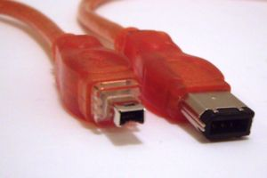

.. _showcase-ieee1394:

IEEE 1394 link layer
====================

The behavior of the Link Layer in asynchronous mode is specified in µCRL.
This layer is the middle layer of the three-layered Firewire protocol,
responsible for construction of packets, the transmission of these over a serial
(one-bit) line to other parties, and the computation and verification of
checksums. Moreover, a Bus-process is specified, describing the external
behavior of the underlying physical components according to IEEE 1394, in order
to be able to simulate the situation where a number of Link Layers communicate
asynchronously.

Technical details
-----------------
Asynchronous mode of the Link Layer of IEEE 1394 was modeled in µCRL based on
the documentation.
 
*Type of verification*
  Deadlock, safety and liveness properties checking.

*Models*
  The µCRL model is available as a part of the µCRL toolset distribution. 
  A translation to mCRL2, performed by Jan Friso Groote, is available as a part
  of the mCRL2 distribution.

*Organizational context*
  :Contact person: Bas Luttik, Technische Universiteit Eindhoven, The Netherlands.
  :Institution: Centrum voor Wiskunde en Informatica (CWI), Amsterdam
  :Time period: The model was written in 1997, translation to mCRL2 in 2005.

Publications
------------

[Lut97]_

