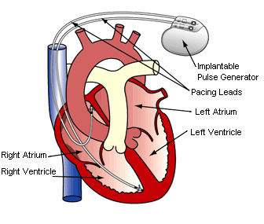

Pacemaker
=========

Vitatron (Medtronic SQDM/Vitatron in full) develops medical appliances such as
pacemakers. The human heart contracts by getting electrical pulses from the
heart's own pacemaker (called sinus node). The pulse rate can show a wide range
of rates depending on the activity level of the rest of the body. Sometimes
health problems occur causing these electrical pulses to come at wrong moments.
This is called an arrhythmia.

A pacemaker (also called Implantable Pulse Generators (IPG)) maintains an
adequate rate in the patient's heart by delivering electrical stimuli (paces) to
the chambers of the heart. The behavior of a pacemaker is to a large extent
determined by the firmware, i.e. the embedded software. The firmware must deal
with all possible rates and arrhythmias, which makes it a complex composition of
collaborating and interacting processes.

In this project the firmware design of Vitatron's DA+ pacemaker has been checked
using both mCRL2 and Uppaal. The analysis did only reveal a known problem
indicating the high quality of the software in these pacemakers.

Technical details
-----------------

Approach
^^^^^^^^
To investigate the verification of a pacemaker firmware design by formal model
checking, several verification approaches were exploited. These approaches
differ in the composition of the verified formal models and the requirements
that have been verified upon them. Two main approaches can be distinguished; in
the first approach, a rather complete formal firmware model was verified in the
context of a formal model of the human heart. The formal model of this approach
was verified for several configurations of the formal heart model; three
requirements have been verified on the resulting models, including absence of
deadlocks and the requirement that the pacing rate never exceeds a certain upper
bound.

In the second main approach, a small part of the firmware model was verified in
the context of a collection of stub and driver processes. The latter approach
was exploited because Vitatron had found a flaw in this firmware part in the
past. On the formal model of this approach, one requirement has been verified
that represents the main purpose of the modeled firmware part.

The initial plan was to model both in mCRL2 and Uppaal. Uppaal was only used for
the initial models because it was not suitable to deal with the full complexity
of the software of the pacemaker.

Technical details
-----------------

Type of verification
^^^^^^^^^^^^^^^^^^^^
In mCRL2, most requirements have been verified by explicit state space
generation using breadth-first search (without actually storing the state
space). For example, the requirement to the model of the second approach was
verified by modeling the stub and driver processes such that a deadlock state
was reached when the requirement was violated. By commanding :ref:`tool-lps2lts' to
detect deadlock states, the formal model was verified. This verification led to
the detection of the flaw that is known at Vitatron. After the detection of this
flaw, the possible consequences of the flaw have been discovered through
adapting the model of the first approach such that the flaw could also occur in
this model. Together these verification have led to important conclusions and
recommendations to Vitatron.

One of the requirements to the model of the first approach was validated by
symbolic model checking using :ref:`tool-pbes2bool`.

Data size
^^^^^^^^^
The state space size depends on the configuration of the formal heart model. For
the first model of the heart model, the state space contains far more than a
billion states. Verifications have been carried out on models with various
restrictions with state space sizes that vary from several thousands of states
till approximately 500 million states.

The second model in which we found a known violation of the requirement contained 
714.464 states. 

Equipment (computers, CPU, RAM)
^^^^^^^^^^^^^^^^^^^^^^^^^^^^^^^
All verifications were performed on a 64 bit linux machine with 128GB RAM.

Models
^^^^^^
The models are confidential.

Organizational context
----------------------

.. list-table:: 

  * - **Contact person**
    - Jan Friso Groote, Technische Universiteit Eindhoven, The Netherlands.
  * - **Other people involved**
    -   * Jaap Wiggelinkhuizen (Student, TU/e, Eindhoven)
        * Jan Tretmans (Supervisor, Embedded Systems Institute, Eindhoven)
        * Erik Hendriksen (Supervisor, Medtronic SQDM/Vitatron, Arnhem)
  * - **Institution**
    - Technische Universiteit Eindhoven, The Netherlands.
  * - **Industrial partner**
    - Medtronic SQDM/Vitatron, Arnhem, Netherlands
  * - **Project**
    - The project was carried out by Jaap Wiggelinkhuizen as a master graduation project at Medtronic SQDM/Vitatron, Arnhem, The Netherlands.
  * - **Time period**
    - The project started in April 2007 and was successfully finished in December 2007.

Publications
------------
.. [Wig07] J.E. Wiggelinkhuizen. Feasibility of formal model checking in the Vitatron environment.
   Master Thesis. Eindhoven University of Technology, 2007
   `(PDF) <http://alexandria.tue.nl/extra2/afstversl/wsk-i/wiggelinkhuizen2007.pdf>`_

