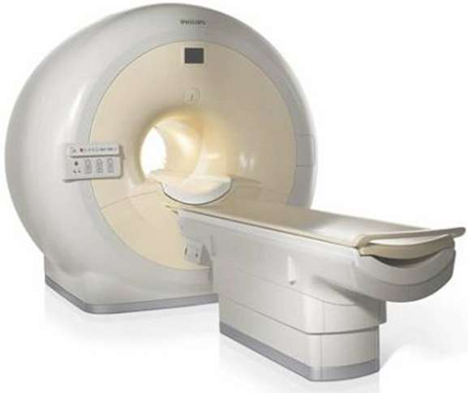

Patient support platform
========================

A distributed software system was designed and built in a demonstration project
meant to test the applicability of formal methods in a real-life environment.
The software was designed from scratch, modeled and validated using mCRL2 and
implemented in Python. The software was embedded in an industrial medical
device.

The device is a Patient Support Platform. During an examination in an `MRI
<http://en.wikipedia.org/wiki/Magnetic_resonance_imaging>`_ scanner, a patient
lies on the upper part of the Platform (called ''carrier''). The movements of
the carrier are controlled by the distributed software system. The software
controls the motors, brakes and other hardware in the Patient Support Platform
and it implements safety requirements to avoid injuring the patient or the
operator of the scanner.

A priori four essential requirements were formulated. As the complexity of the
model was substantial, the analysis of the validity of these requirements on the
model could only be accomplished, after the implementation in python was
finished. Three of the requirements turned out to hold, but unfortunately, one
requirement did not turn out to be true in the mCRL2 model. This failing
requirement indicated a design error in the communication protocol of the new
software, which could also be shown to exist in the implementation. However, it
was considered unlikely to occur in practise, as it was expected that it would
only show up when components run at substantial different speeds, and even then
the undesired internal state causing the problem would exist for only a short
while. 

System description
------------------

Context
^^^^^^^
MRI scanners are used to acquire images of patient tissue. The scanner has a
limited scan range, thus the patient has to be moved into and out of the scanner
during a scan procedure. To accomplish a precise and (semi-)automatic
positioning, a Patient Support Platform is used.

Purpose
^^^^^^^
The Patient Support Platform base is mounted to the floor. Its carrier can move
along two axes: a horizontal and a vertical one.

An MRI scanner is about 1m above the floor. The carrier can be moved downwards and upwards to facilitate a
patient (un)mounting it. When the carrier is in line with the entrance
of the scanner, the bed can move in under operator/system control.

System architecture
^^^^^^^^^^^^^^^^^^^
The movements of the carrier can be controlled by:
  * buttons on a control panel, attached to the scanner and connected to an internal motion control system
  * a wireless remote control, connected to an external computer (i.e. Convertor)
  * software on a host system which controls the entire scan process

.. image:: img/Patsuparch.png
   :align: center
   :width: 250px

The software of the Convertor and Motion Controller was designed in this
project. About 12 iterations were needed to arrive at the final system design of
these components. The software of the Host was already operational and was not
allowed to be changed.

The Motion Controller listens to inputs from the scanner's control panel and
sensors in the Patient Support Platform. It controls the actuators.

The Convertor translates inputs from different devices (with different
interfaces) to commands known by the Motion Controller. The design of the
Convertor enables easy extension of the system - other input devices can easily
be connected and work simultaneously - and still guarantee safety, even if the
new devices are unreliable.

That makes the Convertor the most complex part of the system: it needs
to manage multiple input devices which can conflict with one
another. The Convertor implements a protocol to solve conflicts and is
guaranteed to send only valid and safe motion commands to the
Platform.

Requirements
^^^^^^^^^^^^
The most important safety requirements are implemented in hardware (e.g. the
emergency buttons cut off the power supply to the motors). The software must be
able to detect and handle correctly in such situations, i.e. it does not require
a reset to become operational again.

Other safety requirements are implemented in the software. It concerns the
movements of the carrier. The carrier is not allowed to move horizontally when
it is too low and it is not allowed to move vertically if the carrier is
(partly) inside the scanner. Otherwise, the carrier could collide with the
scanner and damage the equipment or injure the patient or operator.

The carrier is only allowed to perform a motorized movement after an explicit
input from one of the input devices or host software.

Validation
----------
The requirements were formally written as modal
formulae and then checked using the
`Caesar/Aldebaran (CADP) toolset <http://www.inrialpes.fr/vasy/pub/cadp>`_.

Typical requirements that can be verified are:
  * The system shall not deadlock
  * The emergency buttons shall always put the system into a safe state
  * Host system shall always be able to send commands to the Convertor

The safety requirement that checks for illegal carrier movements (i.e. movements
that are potentially unsafe) failed on the model. A trace analysis to the state
were the illegal position was reached, shows that this was due to a fundamental
design error in the Convertor's protocol. This protocol was designed during the
project to enable multiple input devices (wireless remote controller, host
software and possibly other devices in the future) to be connected to the system
simultaneously.

The protocol uses `semaphores <http://en.wikipedia.org/wiki/Semaphore_(programming)>`_
to implement mutual exclusion of the different input devices, but it
does not include the output devices (in this case, the Patient Support
Platform). The mCRL2 model shows that, if the Platform reacts too slow to
commands from the Convertor, it might happen that the Convertor uses out of date
sensor values to check the safety requirements. It can then send commands to the
Platform which cause illegal movements. A solution to this problem is to extend
the mutual exclusion and include the output device(s).

Technical details
-----------------
The software of the Motion Controller and Convertor was designed and modeled
formally in mCRL2. The specification of the host system was based on its
interface implementation (available in C++ code).

*Type of verification*
  Deadlock, reachability and safety properties were validated by explicit
  state-space generation (breadth-first search) and applying modal formulae.

*Data size*
  The state space of the model, without hiding any transitions, is 45 million
  states.

*Equipment (computers, CPU, RAM)*
  Entire state space generation was performed on an 8-way AMD 64 bit machine
  with 128GB RAM.

  The modal formulas were checked on a 32 bit machine with 8GB RAM.

*Models*
  The model is available via Jan Friso Groote. Note that the model was updated
  after the final report of the project was written.

*Organizational context*
  :Contact person: Jan Friso Groote, Technische Universiteit Eindhoven, The 
                   Netherlands.
  :Other people involved: - Tom Engels (Student, TU/e, Eindhoven)
                          - Bas Kloet (Student, TU/e, Eindhoven)
                          - John van der Koijk (Supervisor, Philips Medical 
                            Systems, Best)
  :Institution: Technische Universiteit Eindhoven, The Netherlands.
  :Industrial partner: Philips Medical Systems, Best, Netherlands
  :Project: The project was carried out by two students during their internship 
            at Philips Medical Systems, Best, Netherlands.
  :Time period: The project started in July 2006 and was successfully finished 
                in October 2006. Some final adaptation to the model were made in
                Februari and March 2007.
