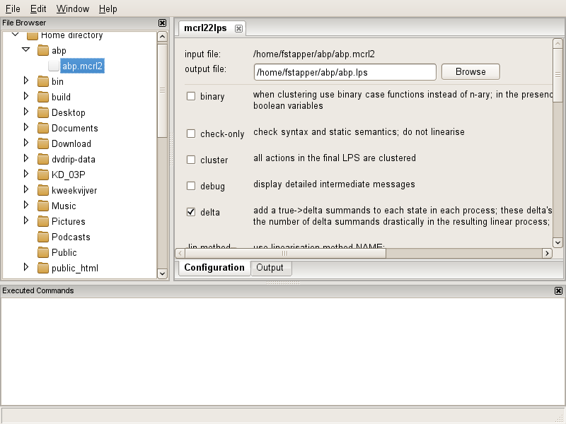

Using mcrl2-gui
===============

All tools in the mCRL2 toolset are, besides their command-line interface, also
available through the graphical user interface in :ref:`tool-mcrl2-gui`.
In this section we show by example how to use the toolset through the graphical
user interface.

Start the *mcrl2-gui* tool by either typing ``mcrl2-gui`` on the command line,
or double click onto the *mcrl2-gui* icon. The *mcrl2-gui* window appears,
showing two panels. One panel displays in a tree-view structure the files on
disk, called "File Browser", right-clicking a file in this panel will show the
supported operations (Transformation, Report, etc.) for the selected file. The
other panel displays the commands that have been executed throughout the
transformation and analysis, called "Executed commands". Throughout the
tutorial, another panel will appear to configure and run tools. This panel is
called the "Configuration panel".

In this tutorial the analysis and transformations are performed on the
alternating bit protocol. The corresponding mCRL2 specification can be
downloaded `here <https://svn.win.tue.nl/trac/MCRL2/export/8044/branches/release/examples/academic/abp/abp.mcrl2>`_
or be found in the ``examples/academic/abp/`` directory of your mCRL2 
installation.

.. _tutorial-img1: ../../_static/img/tutorial/mcrl2gui.png
.. _tutorial-img2: ../../_static/img/tutorial/ltsgraph-abp.jpg
.. _tutorial-img3: ../../_static/img/tutorial/ltsgraph-abpbb.jpg
.. _tutorial-img4: ../../_static/img/tutorial/ltsview-abp.jpg

+-------------------------------+------------------------------------+--------------------------------------+-----------------------------------+
| .. figure:: img/mcrl2gui.png  | .. figure:: img/ltsgraph-abp.jpg   | .. figure:: img/ltsgraph-abpbb.jpg   | .. figure:: img/ltsview-abp.jpg   |
|    :target: `tutorial-img1`_  |    :target: `tutorial-img2`_       |    :target: `tutorial-img3`_         |    :target: `tutorial-img4`_      |
|    :align: center             |    :align: center                  |    :align: center                    |    :align: center                 |
|                               |                                    |                                      |                                   |
|    The :ref:`tool-mcrl2-gui`  |    The :ref:`tool-ltsgraph`        |    The ABP statespace after          |    The :ref:`tool-ltsview`        |
|    interface.                 |    tool, showing the statespace of |    branching bisimulation reduction. |    tool showing the ABP           |
|                               |    the alternating bit protocol.   |                                      |    statespace in 3D.              |
+-------------------------------+------------------------------------+--------------------------------------+-----------------------------------+

Obtaining a linear process specification
^^^^^^^^^^^^^^^^^^^^^^^^^^^^^^^^^^^^^^^^

Navigate with help of the file browser to the mcrl2 specification, that contains
a behavioural description of the alternating bit protocol, named ``abp.mcrl2``.
After right-clicking on the file ``abp.mcrl2``, a pop up menu shows up that
displays the available operations that can be applied to the selected file.
Operations differ per file, per extension and per folder. To transform the mcrl2
specification into a linear specification, we need to use the tool 
:ref:`tool-mcrl22lps`. This tool can be found under
:menuselection:`Transformation --> mcrl22lps`. After selecting *mcrl22lps*, the
*mcrl2-gui* displays the configuration panel, as shown below.

The configuration panel displays the input file, a suggestion for a possible
output-file, the different linearisation options that can be applied and a "run"
button to execute the transformation. The "run" button can be found by scrolling
down the panel. We choose to alter the suggested file name to "abp.lps" and
press the run button. After the button has been pressed, *mcrl22lps* generates
the output file. Notice that the file browser automatically selects the file,
after it has been successfully created.

Generating a labelled transition system
^^^^^^^^^^^^^^^^^^^^^^^^^^^^^^^^^^^^^^^

Now we right-click on the new created file. Note that files with an ``.lps``
extension, have more tools that can use the input for the analysis or
transformation. To generate a labeled transition system, we apply the
transformation :ref:`tool-lps2lts` (:menuselection:`Transformation --> 
lps2lts`). By selecting *lps2lts*, a new tab with options pops up in the
configuration panel. For the moment we ignore all options, and simply click the
run button. A new file called ``abp.lps2lts00.lts`` is generated.

*ltsgraph* and *ltsconvert*
^^^^^^^^^^^^^^^^^^^^^^^^^^^

There are several tools that work on ``.lts`` files. In particular, they can be
visualized using the tool ltsgraph. When starting :ref:`tool-ltsgraph`
(:menuselection:`Analysis --> ltsgraph`), the states and transitions occur at
random places. The states and labels can be moved around using the left mouse
button. By pushing the neaten button, a simple positioning algorithm will start
to optimize the picture. States can still be dragged around while the diagram is
being optimized. Using the right mouse button (Ctrl+mouse on Mac OS X) states
can be locked, which prevents them from being moved around automatically. The
resulting layout can be saved and exported to scalable graphics format (SVG) or
LaTeX (pstricks). It is also possible to colour individual states and to change
the curvature of transitions.

Another tool that works on labelled transition systems, is :ref:`tool-ltsconvert`.
This is a very versatile tool to translate various
representations of labelled transitions systems to each other (e.g. the
``.aut``, ``.svc`` and ``.fsm`` formats). Moreover, it can apply strong,
branching and trace equivalence reductions on the transition systems. Let's
apply *ltsconvert* to ``abp.lps2lts00.lts``. Set the branching bisimulation
reduction option, and generate the reduced transition system (``abp.aut``). Note
that *ltsconvert* generates a file that conforms to a ``.aut`` specification,
given the file extension. Visualizing it, by using *ltsgraph*, yields the third
picture above: a transition system with three states. For those who know the
alternating bit protocol, this exactly depicts its desired external behaviour,
in case it has two data items *d1* and *d2*.

*ltsview* and *diagraphica*
^^^^^^^^^^^^^^^^^^^^^^^^^^^

Using *ltsconvert* it is also possible to create a ``.fsm`` file, which is the
input format for two other graphical tools, namely :ref:`tool-ltsview` and
:ref:`tool-diagraphica`. Start *ltsconvert* on ``abp.lts``. Select as
an output file ``abp.fsm`` and put ``abp.lps`` as the linear process
specification to be used. This last step is needed because the ``.fsm`` format
requires the names, sorts and values of the process variables in each state.
Without it, both *diagraphica* and *ltsview* cannot show the values of the
variables in each state, strongly crippling their functionality. The state space
that shows up in *ltsview* can be navigated using the mouse. It can be coloured
on the basis of the variables in each state, but also using transitions or the
existence of deadlock. Note that for the alternating bit protocol it is possible
to show the individual states, transitions and backpointers. For larger state
spaces (with hundreds of thousands of states), showing too much detail slows the
tool down dramatically.

.. _tutorial-img5: ../../_static/img/tutorial/diagraphica-1.jpg
.. _tutorial-img6: ../../_static/img/tutorial/diagraphica-2.jpg
.. _tutorial-img7: ../../_static/img/tutorial/lpsxsim.jpg
.. _tutorial-img8: ../../_static/img/tutorial/preferences.jpg

+-----------------------------------+------------------------------------+----------------------------------+-----------------------------------+
| .. figure:: img/diagraphica-1.jpg | .. figure:: img/diagraphica-2.jpg  | .. figure:: img/lpsxsim.jpg      | .. figure:: img/preferences.jpg   |
|    :target: `tutorial-img5`_      |    :target: `tutorial-img6`_       |    :target: `tutorial-img7`_     |    :target: `tutorial-img8`_      |
|    :align: center                 |    :align: center                  |    :align: center                |    :align: center                 |
|                                   |                                    |                                  |                                   |
|    Diagraphica visualises process |    Diagraphica as a graphical      |    The *lpsxsim* tool simulating |    The edit window allows to use  |
|    parameters.                    |    simulator.                      |    the alternating bit protocol. |    external editors.              |
+-----------------------------------+------------------------------------+----------------------------------+-----------------------------------+

The tool *diagraphica* allows to visualize the process parameters that make up
each state. If *diagraphica* is started, the process parameters are listed in
the window to the left. For the alternating bit protocol these are *s30*, *d*,
*b*, *s31*, etc. Using the mouse a subset of these variables can be selected and
the whole state space is projected onto the selected variables by pushing the
:guilabel:`Cluster nodes` button. Using different options under
:menuselection:`Attributes` in the main menu, it is possible to visualize
properties of the selected variables.

In the view on the right, the circles represent aggregated states. The circular
shapes between these nodes are aggregated transitions, and must be read
clockwise. It is possible to get an impression of the distribution of all values
in the state space by switching to the trace view. By selecting some variables
and performing a trace view, the values of the selected variables of all states
are graphically represented in the window at the bottom. The result looks as in
the leftmost picture above.

Another option of *diagraphica* is to graphically simulate the process. A
graphical view of the process can be edited in *edit mode*. The file
``abp.dgd``, which can be downloaded `here <https://svn.win.tue.nl/trac/MCRL2/export/8044/branches/release/examples/project/abp/abp.dgd>`_,
contains an initial layout, but in edit mode any layout can be made. Using the
:guilabel:`edit DOF` option, that shows up when clicking an object in edit mode,
a pop up window appears showing which colours, shape, position and even
transparency of objects can be made dependent on the state of the process. Back
in analysis mode, with the simulation view, it is possible to observe how the
layout changes while doing simulation steps.

Simulating a linear process specification
^^^^^^^^^^^^^^^^^^^^^^^^^^^^^^^^^^^^^^^^^

The tool :ref:`tool-lpsxsim` operates on ``.lps`` files and can be used to
simulate a process. The third picture above shows its interface. A very useful
feature of *lpsxsim* is its capability to load traces. Traces generated with
other tools (such as *lps2lts*) can easily be investigated in this way. For this
purpose there are a trace view possibility and capabilities to walk back and
forth through the trace. The tool lpsxsim can be interfaced to external viewers
to build realistic prototype simulation of the modelled artefacts.

Setting an external editor in mcrl2-gui
^^^^^^^^^^^^^^^^^^^^^^^^^^^^^^^^^^^^^^^

*mcrl2-gui* uses the system defined editors that belong to a particular file
extension. If a user wants (or needs) to define/override an editor, this can be
accomplished in the preferences window (:menuselection:`Window -->
Preferences`). For each file extension an associated editor can be set. Use the
``%s`` symbol to indicate the current file on which the editor must operate.

Concluding remarks
------------------

With these tools many basic analyses on behavioural descriptions can be
performed. All available tools are described in the :ref:`tool-documentation`,
although generally in terms of command line invocation.
